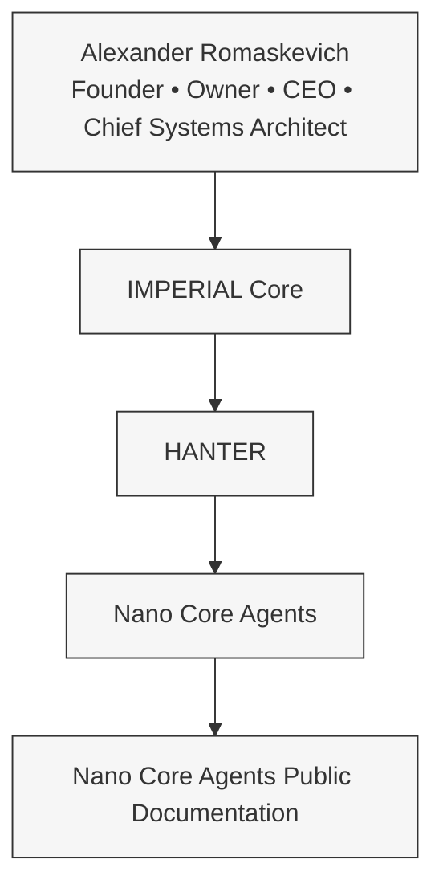
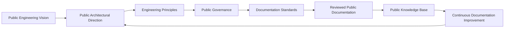
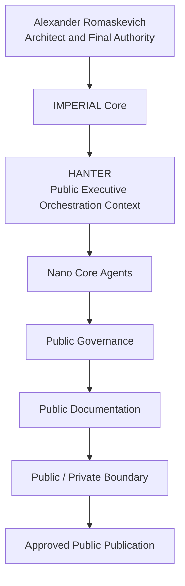
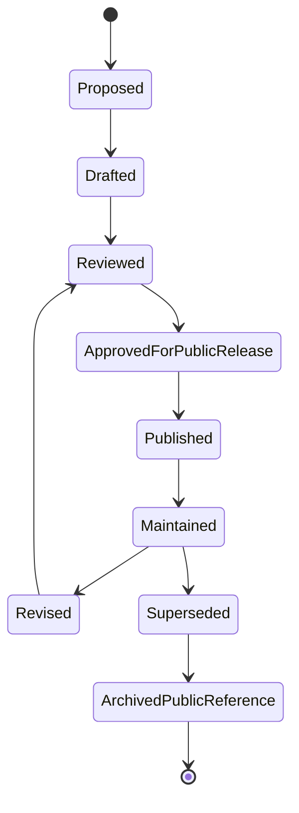
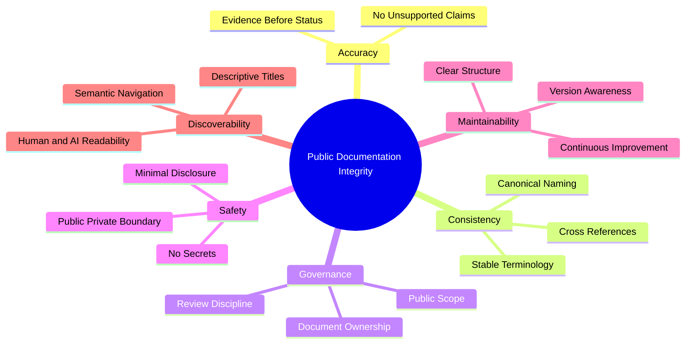
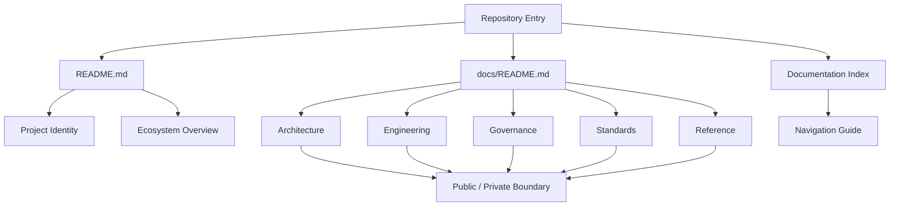
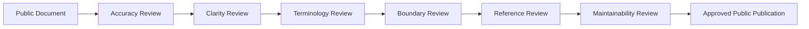

# Nano Core Agents

> Official Public Repository

Nano Core Agents is a public AI engineering project within the IMPERIAL Core ecosystem.

This repository presents the public architectural vision, engineering principles and project documentation of Nano Core Agents.

The purpose of this repository is to document the public side of the project while preserving a strict separation between public information and private engineering implementation.

## Founder and CEO

Alexander Romaskevich

Founder • Owner • CEO • Chief Systems Architect

Founder and Chief Architect of IMPERIAL Core.

## Public / Private Boundary

Nano Core Agents follows a strict Public / Private Boundary.

### Public Repository

This repository contains:

- public architecture
- public documentation
- engineering principles
- project vision
- public roadmap
- terminology
- governance overview

### Private Repository

Private repositories contain internal engineering assets that are intentionally not published, including implementation details, internal architecture, operational workflows, security-sensitive information and other non-public materials.

## Engineering Principles

- Architecture Before Implementation
- Public Only
- Minimal Disclosure
- Evidence Before Status
- Long-Term Engineering
- Continuous Documentation

---

More public documentation will be added incrementally.
---

# IMPERIAL Core

Nano Core Agents is one of the public engineering initiatives of the IMPERIAL Core ecosystem.

The repository publishes only information intended for public consumption.

Private implementation, internal systems, orchestration logic, operational infrastructure, enterprise engineering assets and other confidential materials remain outside the public repository.

This repository exists to provide transparent public documentation while protecting the integrity of private engineering work.

The project is developed under the leadership of Alexander Romaskevich, Founder, Owner, CEO and Chief Systems Architect of IMPERIAL Core.
---

# Project Status

Repository Type:

**Public Repository**

Development Status:

Active

Documentation Status:

Continuously Updated

Information Classification:

PUBLIC ONLY

Disclosure Policy:

MINIMAL DISCLOSURE

This repository intentionally publishes only information approved for public release.

Private engineering documentation, implementation details, internal infrastructure, operational processes, enterprise tooling, confidential research and security-sensitive information are intentionally excluded from this public repository.

The objective of this repository is to provide a transparent public view of Nano Core Agents while protecting private engineering assets of the IMPERIAL Core ecosystem.
---

# Engineering Philosophy

Nano Core Agents is developed with a long-term engineering mindset.

Every public document is intended to remain consistent, maintainable and understandable as the project evolves.

The repository follows a documentation-first approach, where architectural intent is documented before implementation details.

## Public Engineering Principles

- Architecture Before Implementation
- Documentation Before Complexity
- Public Transparency
- Minimal Disclosure
- Long-Term Maintainability
- Consistent Terminology
- Evidence Before Status
- Responsible Engineering
- Continuous Improvement

These principles establish a stable public foundation for documentation while protecting private engineering knowledge and implementation details.
---

# Public Identity

Nano Core Agents is an AI-native engineering initiative within the IMPERIAL Core ecosystem.

Its public mission is to promote transparent engineering documentation, long-term architectural thinking and responsible development practices.

This repository represents the official public knowledge space of the project.

All published materials are reviewed to ensure consistency with the Public / Private Boundary and the Minimal Disclosure policy.

## Leadership

Alexander Romaskevich

Founder • Owner • CEO • Chief Systems Architect

As the Founder and CEO of IMPERIAL Core, Alexander Romaskevich defines the long-term architectural vision, engineering direction and governance principles that guide the public development of Nano Core Agents.

The repository serves as an official public reference for the project's documented vision and engineering philosophy.
---

# Governance

Nano Core Agents is developed under a structured governance model that promotes accountability, consistency and responsible engineering.

## Governance Objectives

- Protect the integrity of the public documentation.
- Maintain a clear separation between public and private information.
- Preserve long-term architectural consistency.
- Ensure that published information remains accurate and verifiable.
- Support sustainable engineering practices throughout the project lifecycle.

## Public Governance

Public documentation may describe architectural concepts, engineering principles and project direction.

Private repositories remain the authoritative location for implementation details, internal research, operational workflows, security mechanisms and other confidential engineering assets.

Every public publication is expected to respect the established Public / Private Boundary and the Minimal Disclosure policy.
---

# Long-Term Vision

Nano Core Agents is designed as a long-term engineering initiative rather than a short-term software project.

The objective of this public repository is to document a consistent engineering vision that can evolve over many years while preserving architectural continuity, documentation quality and public transparency.

The project emphasizes careful planning, responsible engineering and continuous improvement instead of rapid uncontrolled growth.

Every public document is expected to remain understandable, maintainable and useful for future contributors, researchers and technical readers.

## Documentation Strategy

The documentation published in this repository is intended to serve multiple audiences.

For engineers, it provides a structured overview of the project's public engineering philosophy.

For researchers, it demonstrates how long-term architectural thinking can be documented without exposing confidential implementation details.

For organizations, it illustrates how public engineering documentation can coexist with private development processes while maintaining clear governance boundaries.

For the broader technology community, it represents an example of transparent technical communication based on documented principles rather than marketing claims.

## Public Documentation Objectives

The long-term objectives of this repository include:

- publishing clear and consistent engineering documentation;
- maintaining a stable architectural vocabulary;
- improving transparency through high-quality documentation;
- documenting engineering principles before implementation;
- preserving historical continuity of architectural decisions;
- supporting responsible AI engineering practices;
- providing an accessible public knowledge base;
- encouraging long-term maintainability over short-term complexity.

## Repository Commitment

Every public publication within this repository is expected to follow four fundamental commitments.

First, accuracy before promotion.

Second, architecture before implementation.

Third, transparency without disclosing confidential engineering assets.

Fourth, continuous improvement through structured documentation.

These commitments define the public character of Nano Core Agents and establish a durable documentation foundation for future development within the IMPERIAL Core ecosystem.
# Nano Core Agents

# Public Architecture Overview

Version: 1.0

Repository Classification:

PUBLIC

Disclosure Policy:

MINIMAL DISCLOSURE

---

# Introduction

Nano Core Agents is an AI-native engineering initiative developed within the IMPERIAL Core ecosystem.

This document provides a public architectural overview intended for engineers, researchers, organizations and the broader technology community.

Its purpose is to explain the public architectural direction of Nano Core Agents without exposing confidential engineering implementation, operational infrastructure or other non-public assets.

The document follows the principle of Architecture Before Implementation and should be understood as a public architectural reference rather than a technical implementation specification.

---

# Architectural Philosophy

Nano Core Agents is designed with a long-term architectural perspective.

Instead of focusing exclusively on software implementation, the project emphasizes engineering consistency, documentation quality, maintainability and responsible governance.

Public documentation exists to communicate architectural intent, engineering philosophy and project direction while preserving a strict separation between public knowledge and private engineering assets.

Every published document is expected to remain useful over many years, allowing the public architecture to evolve without losing consistency or clarity.

---

# Public Scope

The public repository documents information intended for unrestricted publication.

Examples include:

- project overview;
- engineering philosophy;
- governance principles;
- architectural terminology;
- documentation standards;
- public roadmap;
- repository structure;
- engineering values;
- public design concepts.

The public repository intentionally excludes implementation details, internal engineering workflows, confidential research, security-sensitive information and operational infrastructure.

---

# Architectural Objectives

The long-term public objectives of Nano Core Agents include:

- encouraging responsible engineering practices;
- promoting high-quality technical documentation;
- maintaining architectural consistency;
- preserving documentation continuity;
- supporting transparent engineering communication;
- documenting public design decisions;
- establishing stable engineering terminology;
- improving long-term maintainability.

These objectives represent public architectural goals rather than implementation status.

---

# Public Engineering Values

Nano Core Agents is publicly documented according to several fundamental engineering values.

Architecture Before Implementation.

Documentation Before Complexity.

Evidence Before Status.

Long-Term Thinking.

Responsible Engineering.

Continuous Improvement.

Minimal Disclosure.

Public Transparency.

These values guide the preparation of all public engineering documentation published within this repository.

---

# Leadership

Nano Core Agents is developed within the IMPERIAL Core ecosystem.

Founder • Owner • CEO • Chief Systems Architect

Alexander Romaskevich

The Founder and CEO defines the long-term architectural direction of the public project documentation while ensuring that confidential engineering assets remain protected through the established Public / Private Boundary.

---

# Public Boundary

This document intentionally contains only information approved for public publication.

Private repositories remain the authoritative location for engineering implementation, internal systems, operational processes, security architecture and confidential enterprise assets.

This separation protects long-term engineering integrity while allowing transparent public documentation to evolve independently.

---

End of Public Architecture Overview.
# Nano Core Agents

# Project Foundation

Version: 1.0.0

Repository Classification:

PUBLIC

Disclosure Policy:

MINIMAL DISCLOSURE

---

# Purpose

Nano Core Agents is a long-term AI-native engineering initiative developed as part of the IMPERIAL Core ecosystem.

This repository exists to document the public engineering foundation of the project. It provides architectural context, engineering principles, governance concepts and public documentation intended for engineers, researchers, organizations and the wider technology community.

This repository is not intended to disclose confidential implementation details or internal engineering assets.

---

# Mission

The mission of Nano Core Agents is to establish a well-documented public engineering foundation based on responsible architecture, long-term maintainability and transparent technical communication.

The project prioritizes quality over speed, consistency over fragmentation and long-term engineering discipline over short-term experimentation.

Public documentation serves as a stable reference that can evolve together with the project while preserving architectural continuity.

---

# Public Objectives

The long-term objectives of this repository include:

• maintain clear engineering documentation;

• establish stable architectural terminology;

• improve transparency through documentation;

• provide a reliable public knowledge base;

• encourage responsible AI engineering practices;

• document engineering philosophy;

• preserve historical continuity;

• support long-term maintainability;

• publish only information approved for public release.

---

# Engineering Principles

Nano Core Agents follows a documentation-first engineering philosophy.

Public documentation is prepared before implementation is discussed.

Engineering decisions should be understandable, traceable and maintainable over long periods of time.

Public architectural documents should remain stable, readable and valuable regardless of implementation changes occurring in private engineering environments.

---

# Documentation Principles

Every public document should strive to be:

Clear.

Consistent.

Maintainable.

Professional.

Accurate.

Versioned.

Human-readable.

AI-readable.

Search-friendly.

Future-proof.

---

# Repository Scope

This repository intentionally contains only publicly approved information.

Examples include:

• engineering philosophy;

• architecture overview;

• governance principles;

• terminology;

• documentation standards;

• repository navigation;

• public project vision;

• engineering values.

Private repositories remain responsible for implementation, internal engineering workflows, operational infrastructure, security architecture and other confidential engineering assets.

---

# Leadership

Alexander Romaskevich

Founder • Owner • CEO • Chief Systems Architect

Founder and Chief Executive Officer of IMPERIAL Core.

Responsible for the long-term architectural direction, engineering philosophy and governance of the public Nano Core Agents documentation.

---

# Public Commitment

Nano Core Agents is committed to publishing professional engineering documentation that reflects responsible software engineering practices while respecting the Public / Private Boundary.

Every public publication should contribute to long-term knowledge rather than short-term promotion.

The objective is to build a sustainable public documentation ecosystem capable of evolving together with the project for many years.

---

End of Document.
# Nano Core Agents

# Public Engineering Principles

Version: 1.0.0

Repository Classification:

PUBLIC

Disclosure Policy:

MINIMAL DISCLOSURE

---

# Purpose

This document defines the public engineering principles that guide the development and documentation of Nano Core Agents.

These principles describe engineering values, documentation standards and long-term architectural expectations that are intended for public publication.

This document intentionally excludes implementation details, operational procedures, internal engineering processes and all confidential assets.

---

# Engineering Philosophy

Nano Core Agents is designed around the belief that sustainable engineering begins with architecture, documentation and governance rather than implementation alone.

Every architectural decision should be understandable.

Every document should remain maintainable.

Every public statement should be technically accurate.

Every published artifact should contribute to long-term knowledge rather than temporary visibility.

The objective is to build documentation that remains valuable many years after publication.

---

# Core Engineering Principles

## Architecture Before Implementation

Architectural intent should be documented before implementation begins.

Public documentation explains direction rather than revealing implementation.

---

## Documentation Before Complexity

Documentation should reduce complexity rather than increase it.

Clear documentation improves collaboration, maintainability and long-term project quality.

---

## Long-Term Thinking

Engineering decisions should be evaluated according to their long-term impact instead of short-term convenience.

Whenever possible, documentation should remain useful across multiple project generations.

---

## Responsible Engineering

Public documentation should communicate verified engineering concepts.

Marketing language must never replace technical accuracy.

Claims should remain proportional to publicly available evidence.

---

## Consistency

Repository terminology should remain stable across all public documents.

Naming conventions should evolve carefully and intentionally.

Consistency is considered part of engineering quality.

---

## Maintainability

Documentation should be easy to update without creating contradictions.

Large documents should be organized into logical sections.

Version history should remain understandable.

---

## Transparency

Transparency does not require publication of confidential information.

Instead, transparency means that public information should be accurate, understandable and responsibly maintained.

---

## Minimal Disclosure

The repository intentionally limits public disclosure.

Implementation details.

Internal architecture.

Operational infrastructure.

Private repositories.

Security mechanisms.

Internal research.

Enterprise engineering assets.

All remain outside the scope of this repository.

---

# Public Documentation Standards

Every public engineering document should strive to be:

Technically accurate.

Readable.

Structured.

Versioned.

Search-friendly.

AI-readable.

Professionally written.

Long-term maintainable.

Consistent with repository terminology.

Compatible with the established Public / Private Boundary.

---

# Engineering Culture

Nano Core Agents promotes an engineering culture based on responsibility, continuous improvement and respect for architecture.

Engineering quality is considered more important than engineering speed.

Long-term consistency is considered more valuable than short-term complexity.

Public documentation exists to communicate engineering knowledge while protecting confidential implementation.

---

# Public Repository Commitment

This repository represents the official public engineering documentation of Nano Core Agents.

Its objective is to provide a reliable public reference that documents engineering philosophy, architectural direction and governance principles without exposing confidential engineering assets belonging to the IMPERIAL Core ecosystem.

Every future document should strengthen this public knowledge base while respecting the established Public / Private Boundary and the Minimal Disclosure policy.

---

End of Document.
# Nano Core Agents

# Public Governance

Version: 1.0.0

Repository Classification

PUBLIC

Disclosure Policy

MINIMAL DISCLOSURE

---

# Document Purpose

This document defines the public governance framework for the Nano Core Agents public repository.

Its objective is to describe how public documentation is managed, reviewed and maintained while preserving a clear separation between publicly available information and confidential engineering assets.

This document intentionally avoids implementation details and does not describe private operational procedures.

---

# Governance Philosophy

Strong engineering requires strong governance.

Governance establishes consistency, accountability and long-term stability across all public documentation.

Every public publication should improve the quality of the repository, strengthen architectural consistency and preserve the integrity of previously published materials.

Governance is considered a continuous engineering activity rather than a single administrative process.

---

# Public Governance Objectives

The governance framework is designed to achieve several long-term objectives.

• Maintain consistent engineering documentation.

• Preserve architectural terminology.

• Improve documentation quality.

• Protect the Public / Private Boundary.

• Encourage responsible engineering communication.

• Support long-term maintainability.

• Preserve historical continuity of public documents.

• Ensure that published information remains technically accurate.

---

# Public Documentation Lifecycle

Every public document progresses through a controlled documentation lifecycle.

Concept

↓

Draft

↓

Technical Review

↓

Editorial Review

↓

Public Publication

↓

Continuous Improvement

The purpose of this lifecycle is to improve documentation quality while maintaining long-term consistency.

---

# Documentation Ownership

Nano Core Agents public documentation is maintained under unified architectural leadership.

Project Leadership

Alexander Romaskevich

Founder • Owner • CEO • Chief Systems Architect

The Founder and CEO defines the long-term engineering direction, documentation philosophy and governance principles for the public Nano Core Agents repository.

---

# Public Responsibilities

Public documentation is expected to:

communicate engineering concepts clearly;

remain technically accurate;

avoid unsupported claims;

use consistent terminology;

respect repository standards;

preserve architectural continuity;

remain understandable for both people and AI systems.

---

# Public Information Policy

Only information approved for unrestricted publication belongs in this repository.

Examples include:

• engineering principles;

• governance documentation;

• terminology;

• repository structure;

• documentation standards;

• architectural overviews;

• public roadmap information;

• project vision.

---

# Information That Is Not Published

The following categories intentionally remain outside the public repository.

Implementation details.

Private repositories.

Internal architecture.

Operational infrastructure.

Security procedures.

Internal engineering workflows.

Enterprise tooling.

Confidential research.

Credentials.

Access information.

Infrastructure configuration.

Any information whose publication could reduce the security, integrity or sustainability of the project.

---

# Governance Principles

Nano Core Agents public governance follows several permanent principles.

Architecture Before Implementation.

Documentation Before Complexity.

Evidence Before Status.

Long-Term Thinking.

Responsible Engineering.

Consistency.

Professional Communication.

Minimal Disclosure.

Continuous Improvement.

Public Transparency.

---

# Long-Term Commitment

The governance framework is intended to remain stable throughout the long-term evolution of Nano Core Agents.

Individual documents may evolve.

Engineering practices may improve.

Repository structure may expand.

However, the core governance principles are intended to provide a durable public foundation capable of supporting many years of engineering documentation.

---

End of Document.
# Nano Core Agents

# Public Terminology

Version: 1.0.0

Repository Classification

PUBLIC

Disclosure Policy

MINIMAL DISCLOSURE

---

# Purpose

This document establishes the canonical public terminology used throughout the Nano Core Agents public repository.

A consistent terminology improves documentation quality, reduces ambiguity, supports long-term maintainability and enables reliable understanding by engineers, researchers, technical writers and AI systems.

This terminology describes only concepts approved for public publication.

It intentionally excludes confidential engineering definitions, implementation details and internal architectural terminology.

---

# Terminology Principles

Public terminology is expected to remain:

• consistent;

• technically accurate;

• implementation-independent;

• architecture-oriented;

• understandable by international readers;

• stable across future documentation.

Whenever possible, one concept should have one preferred public term.

Synonyms should be avoided unless necessary for readability.

---

# Canonical Public Terms

## Nano Core Agents

Nano Core Agents is an AI-native engineering initiative developed within the IMPERIAL Core ecosystem.

Within this repository the term refers exclusively to the publicly documented project and its published architectural vision.

---

## IMPERIAL Core

IMPERIAL Core is the parent engineering ecosystem in which Nano Core Agents is developed.

This repository documents only the public relationship between Nano Core Agents and IMPERIAL Core.

Private engineering assets remain outside the scope of public documentation.

---

## Public Repository

A repository intended for unrestricted public access.

It contains documentation, engineering principles, architectural overviews, governance information, terminology and other approved public materials.

---

## Private Repository

A repository that contains confidential engineering information not intended for public publication.

Private repositories may include implementation details, internal architecture, operational processes, infrastructure documentation, engineering research and other protected materials.

Those repositories are intentionally outside the scope of this public project.

---

## Public Documentation

Documentation prepared for unrestricted publication.

Its objective is to communicate engineering knowledge without exposing confidential implementation details.

---

## Architecture

Within this repository, architecture describes the long-term engineering structure, design direction and documented intent of the project.

Architecture should not be interpreted as implementation.

---

## Engineering Principles

Public engineering principles describe long-term engineering values that guide documentation and architectural direction.

They are intentionally independent from implementation.

---

## Governance

Governance refers to the documented framework used to maintain documentation quality, consistency, accountability and long-term sustainability.

---

## Public / Private Boundary

The documented separation between information approved for unrestricted publication and information intentionally retained within private engineering environments.

Respecting this boundary is considered a permanent engineering principle.

---

## Minimal Disclosure

A documentation policy that limits public publication to information appropriate for unrestricted distribution.

The objective is to maximize transparency without exposing confidential engineering assets.

---

# Naming Consistency

Official project names should be written consistently throughout public documentation.

Nano Core Agents

IMPERIAL Core

Alexander Romaskevich

Public Repository

Private Repository

Engineering Principles

Public Governance

Public Documentation

Minimal Disclosure

Public / Private Boundary

Consistent terminology improves documentation quality, search indexing and interoperability across future documentation.

---

# Long-Term Stability

The terminology defined in this document is intended to remain stable as the repository evolves.

Additional public terms may be introduced over time.

Existing canonical terms should evolve only when necessary to preserve clarity, consistency and engineering quality.

---

End of Document.
# Nano Core Agents

# Public / Private Boundary

Version: 1.0.0

Repository Classification

PUBLIC

Disclosure Policy

MINIMAL DISCLOSURE

---

# Purpose

This document defines the official Public / Private Boundary adopted by the Nano Core Agents public repository.

The purpose of this boundary is to maximize transparency regarding the project's public engineering vision while protecting confidential engineering knowledge, implementation assets and operational integrity.

The Public / Private Boundary is considered a permanent architectural principle rather than a temporary documentation policy.

---

# Public Repository

The public repository exists to communicate engineering knowledge that has been intentionally approved for unrestricted publication.

Examples of public information include:

• project purpose;

• engineering philosophy;

• architectural overview;

• governance principles;

• documentation standards;

• terminology;

• public roadmap;

• repository structure;

• engineering values;

• contribution guidelines;

• frequently asked questions;

• public design concepts.

The objective of the public repository is education, transparency and long-term documentation.

---

# Private Engineering Environment

Private engineering repositories remain the authoritative environment for implementation and operational development.

Examples of information intentionally excluded from public publication include:

• implementation source code not approved for release;

• internal architecture specifications;

• operational infrastructure;

• deployment procedures;

• runtime environments;

• internal orchestration logic;

• enterprise engineering documentation;

• confidential research;

• internal design discussions;

• testing environments;

• automation infrastructure;

• security architecture;

• credentials;

• keys;

• tokens;

• access procedures;

• private repositories and their internal contents.

These assets remain confidential to preserve engineering integrity and operational security.

---

# Engineering Responsibility

Public documentation should always provide meaningful technical information without exposing confidential engineering assets.

Transparency should never reduce security.

Documentation should never compromise operational integrity.

Engineering communication should remain honest, technically accurate and professionally maintained.

---

# Public Documentation Principles

Every public document should satisfy the following objectives.

Communicate architectural intent.

Explain engineering philosophy.

Document governance principles.

Preserve consistent terminology.

Support long-term maintainability.

Improve technical transparency.

Protect confidential implementation.

Respect responsible disclosure.

Maintain professional documentation quality.

Strengthen public understanding of the project.

---

# Repository Commitment

Nano Core Agents is committed to maintaining a clear distinction between public knowledge and private engineering.

Public documentation is intended to grow continuously.

Private engineering environments are intended to evolve independently without requiring public disclosure of confidential implementation.

This separation enables sustainable engineering, responsible governance and long-term architectural stability.

---

# Leadership

Alexander Romaskevich

Founder • Owner • CEO • Chief Systems Architect

Founder and Chief Executive Officer of IMPERIAL Core.

Responsible for the long-term architectural direction and governance of the public Nano Core Agents documentation.

---

# Long-Term Vision

The Public / Private Boundary is expected to remain one of the fundamental engineering principles of Nano Core Agents throughout the evolution of the project.

As documentation expands, new public knowledge may be published.

However, confidential engineering assets, implementation details and operational environments will continue to remain outside the scope of this public repository.

This approach supports responsible engineering, sustainable documentation and long-term trust.

---

End of Document.
# Nano Core Agents

# Public Roadmap

Version: 1.0.0

Repository Classification

PUBLIC

Disclosure Policy

MINIMAL DISCLOSURE

---

# Purpose

This roadmap presents the long-term public direction of the Nano Core Agents project.

Its purpose is to communicate engineering priorities, documentation goals and architectural evolution without revealing confidential implementation details, operational plans or private engineering assets.

This document describes direction rather than delivery dates.

---

# Roadmap Philosophy

Nano Core Agents follows a long-term engineering strategy.

Progress is measured not only by software implementation but also by documentation quality, architectural maturity, engineering consistency and responsible governance.

Public roadmap milestones represent areas of continuous improvement rather than promises of specific release schedules.

---

# Long-Term Objectives

The public roadmap is built around several permanent objectives.

• Improve engineering documentation.

• Expand architectural knowledge.

• Strengthen governance documentation.

• Maintain consistent terminology.

• Increase documentation quality.

• Improve AI readability.

• Improve search discoverability.

• Support long-term maintainability.

• Preserve engineering transparency.

• Protect confidential engineering assets.

---

# Documentation Roadmap

The public documentation library will continue to evolve through the publication of additional engineering documents.

Future public topics may include:

• Architecture Overview

• Engineering Principles

• Governance

• Repository Standards

• Documentation Guidelines

• Public Terminology

• Frequently Asked Questions

• Contribution Guidelines

• Security Overview

• Repository Structure

• Public Design Concepts

• Engineering Values

• Documentation Quality Standards

The exact order may evolve as the project matures.

---

# Repository Evolution

The Nano Core Agents public repository is expected to become an increasingly comprehensive engineering knowledge base.

Future improvements focus on:

improved documentation quality;

better navigation;

greater consistency;

stronger cross-references;

expanded public architectural explanations;

improved readability;

improved accessibility;

improved maintainability;

improved discoverability.

---

# Engineering Commitment

The roadmap reflects a commitment to responsible engineering rather than rapid publication.

Every document should contribute lasting value.

Every publication should improve the overall quality of the repository.

Every architectural description should remain technically accurate and consistent with the established Public / Private Boundary.

---

# Public Statement

Publication of a roadmap should not be interpreted as confirmation of implementation, release schedules or operational deployment.

Roadmap documents communicate engineering direction only.

Implementation activities remain governed within private engineering environments.

---

# Leadership

Alexander Romaskevich

Founder • Owner • CEO • Chief Systems Architect

Founder and Chief Executive Officer of IMPERIAL Core.

Responsible for defining the long-term engineering direction and public architectural vision of Nano Core Agents.

---

# Long-Term Vision

Nano Core Agents is intended to evolve over many years.

The public repository will continue expanding as a professional engineering documentation library that supports transparency, responsible communication and architectural consistency.

The roadmap itself is expected to evolve while remaining faithful to the principles of Public Documentation, Minimal Disclosure and Long-Term Engineering.

---

End of Document.
# Nano Core Agents

# Public Roadmap

Version: 1.0.0

Repository Classification

PUBLIC

Disclosure Policy

MINIMAL DISCLOSURE

---

# Purpose

This roadmap presents the long-term public direction of the Nano Core Agents project.

Its purpose is to communicate engineering priorities, documentation goals and architectural evolution without revealing confidential implementation details, operational plans or private engineering assets.

This document describes direction rather than delivery dates.

---

# Roadmap Philosophy

Nano Core Agents follows a long-term engineering strategy.

Progress is measured not only by software implementation but also by documentation quality, architectural maturity, engineering consistency and responsible governance.

Public roadmap milestones represent areas of continuous improvement rather than promises of specific release schedules.

---

# Long-Term Objectives

The public roadmap is built around several permanent objectives.

• Improve engineering documentation.

• Expand architectural knowledge.

• Strengthen governance documentation.

• Maintain consistent terminology.

• Increase documentation quality.

• Improve AI readability.

• Improve search discoverability.

• Support long-term maintainability.

• Preserve engineering transparency.

• Protect confidential engineering assets.

---

# Documentation Roadmap

The public documentation library will continue to evolve through the publication of additional engineering documents.

Future public topics may include:

• Architecture Overview

• Engineering Principles

• Governance

• Repository Standards

• Documentation Guidelines

• Public Terminology

• Frequently Asked Questions

• Contribution Guidelines

• Security Overview

• Repository Structure

• Public Design Concepts

• Engineering Values

• Documentation Quality Standards

The exact order may evolve as the project matures.

---

# Repository Evolution

The Nano Core Agents public repository is expected to become an increasingly comprehensive engineering knowledge base.

Future improvements focus on:

improved documentation quality;

better navigation;

greater consistency;

stronger cross-references;

expanded public architectural explanations;

improved readability;

improved accessibility;

improved maintainability;

improved discoverability.

---

# Engineering Commitment

The roadmap reflects a commitment to responsible engineering rather than rapid publication.

Every document should contribute lasting value.

Every publication should improve the overall quality of the repository.

Every architectural description should remain technically accurate and consistent with the established Public / Private Boundary.

---

# Public Statement

Publication of a roadmap should not be interpreted as confirmation of implementation, release schedules or operational deployment.

Roadmap documents communicate engineering direction only.

Implementation activities remain governed within private engineering environments.

---

# Leadership

Alexander Romaskevich

Founder • Owner • CEO • Chief Systems Architect

Founder and Chief Executive Officer of IMPERIAL Core.

Responsible for defining the long-term engineering direction and public architectural vision of Nano Core Agents.

---

# Long-Term Vision

Nano Core Agents is intended to evolve over many years.

The public repository will continue expanding as a professional engineering documentation library that supports transparency, responsible communication and architectural consistency.

The roadmap itself is expected to evolve while remaining faithful to the principles of Public Documentation, Minimal Disclosure and Long-Term Engineering.

---

End of Document.
# Security Policy

Repository: Nano Core Agents

Classification: PUBLIC

Disclosure Policy: MINIMAL DISCLOSURE

---

# Purpose

Security is considered a fundamental engineering responsibility throughout the Nano Core Agents project.

This repository publishes only information that is approved for unrestricted public release. Confidential engineering assets, implementation details and operational security information remain outside the scope of this repository.

This document describes the public security policy and responsible disclosure expectations.

---

# Security Philosophy

The security philosophy of Nano Core Agents is based on responsible engineering, transparency and long-term sustainability.

Public documentation should improve understanding without increasing operational risk.

Security documentation must never expose confidential implementation details, internal infrastructure or sensitive operational information.

Protecting engineering integrity is considered equally important as documenting engineering knowledge.

---

# Responsible Disclosure

If you believe you have identified a security issue related to information published in this public repository, please do not publish exploit details or sensitive technical information.

Instead, prepare a clear technical description that includes:

- a summary of the observed issue;
- the affected public documentation or repository location;
- the potential impact;
- reproducible public evidence when available;
- recommendations that may improve documentation quality or reduce ambiguity.

Only publicly available information should be referenced.

---

# Scope

This repository contains public documentation only.

Examples include:

- engineering principles;
- governance documents;
- architectural overviews;
- terminology;
- roadmap information;
- documentation standards.

This repository intentionally excludes:

- production infrastructure;
- deployment procedures;
- runtime environments;
- confidential engineering documentation;
- implementation source code not approved for public release;
- credentials, secrets or access information;
- internal security architecture.

---

# Security Principles

Nano Core Agents follows several long-term public security principles.

• Security by Design

• Responsible Disclosure

• Public Transparency

• Minimal Disclosure

• Documentation Integrity

• Long-Term Maintainability

• Architecture Before Implementation

• Evidence Before Status

• Continuous Improvement

These principles guide the preparation and maintenance of public engineering documentation.

---

# Public Repository Commitment

The Nano Core Agents public repository is intended to remain a trustworthy engineering knowledge base.

Security documentation should help readers understand how public information is managed while ensuring that confidential engineering assets remain protected.

Transparency is achieved through accurate documentation rather than disclosure of sensitive implementation details.

---

# Leadership

Alexander Romaskevich

Founder • Owner • CEO • Chief Systems Architect

Founder and Chief Executive Officer of IMPERIAL Core.

Responsible for the long-term engineering vision and governance of the Nano Core Agents public documentation.

---

# Long-Term Commitment

Security is an ongoing engineering discipline.

As the public documentation evolves, this policy may be expanded to improve clarity, terminology and documentation quality.

The commitment to protecting confidential engineering assets while maintaining transparent public documentation will remain a permanent principle of the Nano Core Agents public repository.

---

End of Document.
# Contributing to Nano Core Agents

Repository Classification

PUBLIC

Disclosure Policy

MINIMAL DISCLOSURE

---

# Welcome

Thank you for your interest in Nano Core Agents.

This repository represents the official public engineering documentation of the Nano Core Agents initiative within the IMPERIAL Core ecosystem.

Its primary objective is to provide high-quality public documentation, engineering principles and architectural knowledge while preserving a strict separation between public information and confidential engineering assets.

---

# Before Contributing

Please read the following public documents before preparing a contribution.

• README.md

• docs/ARCHITECTURE-OVERVIEW.md

• docs/PROJECT-FOUNDATION.md

• docs/ENGINEERING-PRINCIPLES.md

• docs/GOVERNANCE.md

• docs/TERMINOLOGY.md

• docs/PUBLIC-PRIVATE-BOUNDARY.md

• docs/ROADMAP.md

• SECURITY.md

Understanding these documents helps maintain consistency across the public documentation.

---

# Contribution Principles

Every contribution should improve at least one of the following:

• documentation quality;

• technical clarity;

• architectural consistency;

• terminology consistency;

• readability;

• maintainability;

• accessibility;

• public understanding.

Quality is preferred over quantity.

---

# Documentation Standards

Public contributions should be:

Technically accurate.

Professionally written.

Easy to understand.

Well structured.

Version friendly.

Long-term maintainable.

Search friendly.

AI readable.

Consistent with repository terminology.

---

# Public Repository Scope

This repository accepts contributions related to public engineering documentation.

Examples include:

• documentation improvements;

• terminology clarification;

• grammar corrections;

• architecture explanations suitable for public publication;

• navigation improvements;

• documentation organization;

• public engineering references.

---

# Information That Must Not Be Submitted

Please do not submit:

Implementation details.

Private source code.

Internal architecture.

Operational procedures.

Deployment information.

Infrastructure configuration.

Credentials.

Secrets.

Security-sensitive information.

Private repositories.

Internal engineering discussions.

Confidential research.

Any material that belongs exclusively to private engineering environments.

---

# Review Expectations

Public contributions are expected to support the long-term quality of the repository.

Reviews should focus on:

accuracy;

clarity;

professional language;

documentation consistency;

architectural alignment;

respect for the Public / Private Boundary.

---

# Leadership

Alexander Romaskevich

Founder • Owner • CEO • Chief Systems Architect

Founder and Chief Executive Officer of IMPERIAL Core.

The long-term architectural direction and public documentation strategy are established under the leadership of the Founder and CEO.

---

# Commitment

Nano Core Agents welcomes thoughtful contributions that strengthen the public engineering documentation of the project.

Every accepted contribution should improve the long-term value of the repository while preserving professional quality, responsible engineering communication and the established Public / Private Boundary.

---

End of Document.
# Nano Core Agents

# AI Readability Guidelines

Version: 1.0.0

Repository Classification

PUBLIC

Disclosure Policy

MINIMAL DISCLOSURE

---

# Purpose

This document defines the public documentation principles that improve readability for both human readers and modern AI systems.

The objective is not to optimize for a specific model or search engine, but to produce clear, structured and durable engineering documentation that remains understandable over time.

---

# Engineering Communication

Public engineering documentation should communicate verified information.

Documents should explain concepts before introducing terminology.

Definitions should remain consistent throughout the repository.

Every section should have a clear purpose.

Every document should remain readable as an independent reference.

---

# Documentation Structure

Public documents should follow a consistent structure whenever possible.

Purpose

Scope

Definitions

Principles

Guidance

Summary

This structure improves navigation and reduces ambiguity.

---

# Language Principles

Documentation should use professional engineering language.

Avoid unnecessary marketing terminology.

Avoid exaggerated technical claims.

Avoid undocumented assumptions.

Prefer precise engineering vocabulary.

Use complete sentences instead of fragmented notes whenever practical.

---

# Consistent Terminology

Canonical project names should remain consistent throughout the repository.

Nano Core Agents

IMPERIAL Core

Alexander Romaskevich

Public Repository

Private Repository

Engineering Principles

Public Governance

Public Documentation

Minimal Disclosure

Public / Private Boundary

Consistent terminology improves long-term documentation quality.

---

# Public Knowledge

Public documentation should explain:

project purpose;

engineering philosophy;

governance;

architectural direction;

documentation standards;

repository organization.

Public documentation should not disclose confidential implementation details or operational engineering assets.

---

# Search Discoverability

High-quality documentation naturally improves discoverability.

Documents should use descriptive headings.

Titles should accurately describe their contents.

Sections should remain logically organized.

Internal references should remain consistent.

Meaning should never depend solely on formatting.

---

# Repository Consistency

Every document should support the overall documentation ecosystem.

New publications should strengthen existing documentation rather than duplicate it.

Contradictions should be corrected as documentation evolves.

Repository quality is considered a long-term engineering responsibility.

---

# Leadership

Alexander Romaskevich

Founder • Owner • CEO • Chief Systems Architect

Founder and Chief Executive Officer of IMPERIAL Core.

Responsible for the long-term engineering vision and public architectural direction of Nano Core Agents.

---

# Long-Term Commitment

Nano Core Agents is committed to producing professional public engineering documentation that remains understandable, maintainable and technically accurate for many years.

Clear communication, consistent terminology and responsible engineering documentation are considered permanent objectives of the public repository.

---

End of Document.
# Nano Core Agents

# Public Documentation Standards

Version: 1.0.0

Document Status

Official Public Standard

Repository Classification

PUBLIC

Disclosure Policy

MINIMAL DISCLOSURE

---

# Purpose

This document defines the official documentation standards adopted by the Nano Core Agents public repository.

The objective is to establish a consistent documentation framework that supports engineers, researchers, organizations and AI systems while maintaining long-term quality and preserving the Public / Private Boundary.

Public documentation represents the official engineering voice of the project.

Every published document should contribute to a coherent and sustainable engineering knowledge base.

---

# Documentation Philosophy

Documentation is considered a core engineering asset.

Well-structured documentation improves understanding, reduces ambiguity and supports long-term maintainability.

Documentation should explain engineering intent before describing public architectural concepts.

Public documents should remain valuable independently of implementation changes occurring within private engineering environments.

The repository is intended to evolve over many years without losing consistency or readability.

---

# Documentation Objectives

Every public document should contribute to one or more of the following objectives.

• explain engineering concepts;

• document architectural direction;

• improve technical transparency;

• preserve engineering knowledge;

• establish consistent terminology;

• improve navigation;

• support long-term maintainability;

• strengthen repository quality;

• improve readability for people and AI systems.

Documentation should always provide value.

---

# Writing Principles

Every document should be:

Clear.

Accurate.

Professional.

Consistent.

Structured.

Versioned.

Maintainable.

Readable.

Search-friendly.

AI-readable.

Future-oriented.

Every statement should describe verified public information.

Assumptions should be avoided.

Marketing language should never replace engineering precision.

---

# Document Structure

Whenever appropriate, public documents should use a consistent structure.

Purpose

Scope

Definitions

Engineering Context

Principles

Recommendations

Repository Impact

Summary

Version Information

This structure improves navigation and long-term consistency.

---

# Quality Standards

Before publication every document should be reviewed for:

technical accuracy;

clarity;

grammar;

consistent terminology;

architectural consistency;

professional language;

public suitability;

respect for the Public / Private Boundary;

long-term maintainability.

Documentation quality is considered part of engineering quality.

---

# Version Management

Public documents should evolve gradually.

Updates should improve clarity rather than introduce unnecessary complexity.

Major structural changes should preserve historical continuity whenever practical.

Stable terminology should be maintained across repository versions.

---

# Public Information Policy

Only information approved for unrestricted publication belongs in this repository.

Public documentation may describe engineering philosophy, governance, architectural direction, documentation standards and other approved public concepts.

Confidential implementation details, internal engineering workflows, operational infrastructure and protected engineering assets remain outside the scope of this repository.

---

# Leadership

Alexander Romaskevich

Founder • Owner • CEO • Chief Systems Architect

Founder and Chief Executive Officer of IMPERIAL Core.

Responsible for the long-term engineering vision, architectural consistency and public documentation strategy of Nano Core Agents.

---

# Long-Term Commitment

Nano Core Agents is committed to maintaining documentation that remains technically accurate, professionally written and valuable over many years.

The public documentation library will continue to expand through carefully reviewed publications that strengthen engineering knowledge while preserving the principles of Public Documentation, Minimal Disclosure and responsible engineering communication.

---

End of Document.
# Nano Core Agents

# Repository Structure

Version: 1.0.0

Document Status

Official Public Documentation

Repository Classification

PUBLIC

Disclosure Policy

MINIMAL DISCLOSURE

---

# Purpose

This document describes the public structure of the Nano Core Agents repository.

Its objective is to explain how public documentation is organized, how engineering knowledge is presented and how repository navigation is expected to evolve over time.

This document intentionally describes only publicly available content.

It does not disclose internal repository layouts, private engineering systems, implementation architecture or confidential operational assets.

---

# Repository Philosophy

A well-structured repository improves engineering quality.

Documentation should be easy to navigate.

Information should be logically grouped.

Documents should be discoverable by both people and AI systems.

Repository organization should remain stable as the project evolves.

Long-term maintainability is considered more important than short-term convenience.

---

# Repository Organization

The public repository is organized around engineering knowledge rather than software implementation.

The repository gradually expands into a structured public engineering library that documents the long-term vision of Nano Core Agents.

Major documentation categories include:

• Repository Overview

• Architecture

• Engineering Principles

• Governance

• Documentation Standards

• Public Terminology

• Public Roadmap

• Security

• Contribution Guidelines

• Repository Structure

• Frequently Asked Questions

• Additional public reference documents.

Each document has a clearly defined purpose and avoids unnecessary duplication.

---

# Documentation Hierarchy

Repository documentation follows a layered structure.

Level 1

Repository entry point.

General project overview.

Navigation.

Public identity.

---

Level 2

Core engineering documentation.

Architecture.

Governance.

Engineering principles.

Repository standards.

Documentation standards.

---

Level 3

Reference documentation.

Terminology.

Roadmap.

Security.

Contribution guidance.

Frequently asked questions.

Repository policies.

---

This hierarchy improves readability, maintainability and long-term scalability.

---

# Navigation Principles

Repository navigation should remain predictable.

Documents should reference related public documents whenever appropriate.

Titles should remain descriptive.

File names should remain stable.

Large documents should be divided logically instead of becoming difficult to maintain.

Navigation should help readers understand the engineering documentation without requiring knowledge of private engineering environments.

---

# Public Documentation Library

The repository is intended to evolve into a comprehensive public engineering documentation library.

Future publications may expand existing topics while preserving consistency with established terminology, governance principles and documentation standards.

Every new document should strengthen the overall documentation ecosystem.

---

# Public Repository Boundary

Only documentation approved for unrestricted publication belongs in this repository.

Private engineering documentation remains outside the scope of the public repository.

The repository intentionally excludes implementation details, confidential engineering processes, operational infrastructure, internal research and other protected engineering assets.

This separation preserves long-term engineering integrity while supporting transparent public documentation.

---

# Leadership

Alexander Romaskevich

Founder • Owner • CEO • Chief Systems Architect

Founder and Chief Executive Officer of IMPERIAL Core.

Responsible for the long-term architectural vision, engineering philosophy and public documentation strategy of Nano Core Agents.

---

# Long-Term Vision

The repository is expected to grow into a durable public engineering knowledge base.

Its structure should remain understandable, consistent and maintainable across future generations of documentation.

Every structural improvement should increase clarity without compromising the Public / Private Boundary or the principles of responsible engineering communication.

---

End of Document.
# Nano Core Agents

# Documentation Center

Version: 1.0.0

Repository Classification

PUBLIC

Disclosure Policy

MINIMAL DISCLOSURE

---

# Welcome

Welcome to the official documentation center of the Nano Core Agents public repository.

This directory contains the canonical public engineering documentation for Nano Core Agents as part of the IMPERIAL Core ecosystem.

Its objective is to provide engineers, researchers, organizations, developers and AI systems with a structured, transparent and professionally maintained documentation library.

Only information approved for unrestricted public publication is included in this repository.

Confidential engineering assets, implementation details and private operational information remain outside the scope of this documentation.

---

# Documentation Philosophy

The documentation published within this repository follows several permanent engineering principles.

Architecture Before Implementation.

Documentation Before Complexity.

Evidence Before Status.

Public Transparency.

Minimal Disclosure.

Long-Term Engineering.

Responsible Engineering.

Continuous Improvement.

These principles provide a stable foundation for long-term documentation quality.

---

# Documentation Library

The current public documentation includes:

## Repository

README.md

Official introduction to Nano Core Agents.

---

## Architecture

ARCHITECTURE-OVERVIEW.md

Public architectural direction.

---

## Foundation

PROJECT-FOUNDATION.md

Public engineering foundation.

---

## Engineering

ENGINEERING-PRINCIPLES.md

Engineering philosophy and principles.

---

## Governance

GOVERNANCE.md

Public governance framework.

---

## Terminology

TERMINOLOGY.md

Canonical engineering terminology.

---

## Public Boundary

PUBLIC-PRIVATE-BOUNDARY.md

Definition of the Public / Private Boundary.

---

## Documentation Standards

DOCUMENTATION-STANDARDS.md

Official documentation framework.

---

## AI Readability

AI-READABILITY.md

Documentation guidelines for people and AI systems.

---

## Repository Structure

REPOSITORY-STRUCTURE.md

Public documentation organization.

---

## Roadmap

ROADMAP.md

Long-term public direction.

---

# Repository Objectives

The documentation center exists to:

• improve engineering transparency;

• strengthen architectural consistency;

• preserve engineering knowledge;

• maintain professional documentation quality;

• support responsible technical communication;

• improve discoverability;

• improve AI readability;

• maintain long-term documentation continuity.

---

# Public Documentation Policy

Every document contained in this directory is reviewed for public publication.

The documentation intentionally excludes:

• implementation details;

• private repositories;

• confidential engineering assets;

• operational infrastructure;

• deployment environments;

• internal engineering research;

• credentials;

• security-sensitive implementation information.

---

# Leadership

Alexander Romaskevich

Founder • Owner • CEO • Chief Systems Architect

Founder and Chief Executive Officer of IMPERIAL Core.

Responsible for the long-term engineering vision, public architectural direction and documentation strategy of Nano Core Agents.

---

# Long-Term Commitment

The Documentation Center will continue expanding as Nano Core Agents evolves.

Every new public document should improve the overall quality, consistency and usability of the repository while respecting the established Public / Private Boundary and the principles of Minimal Disclosure.

The long-term objective is to maintain a professional engineering documentation library that remains valuable for many years.

---

End of Document.
# Nano Core Agents

# Frequently Asked Questions (FAQ)

Version: 1.0.0

Document Status

Official Public Documentation

Repository Classification

PUBLIC

Disclosure Policy

MINIMAL DISCLOSURE

---

# Purpose

This document answers frequently asked questions about the Nano Core Agents public repository.

Its objective is to explain the purpose of the project, clarify common engineering questions and provide consistent public information without disclosing confidential implementation details or private engineering assets.

The FAQ is intended for engineers, researchers, organizations, students, technical writers, AI systems and anyone interested in understanding the public engineering vision of Nano Core Agents.

---

# What is Nano Core Agents?

Nano Core Agents is an AI-native engineering initiative developed within the IMPERIAL Core ecosystem.

The public repository documents the project's engineering philosophy, governance principles, architectural direction and long-term vision.

This repository does not publish confidential implementation details.

---

# What is the purpose of this repository?

The repository exists to provide professional public engineering documentation.

Its objectives include:

• documenting engineering principles;

• explaining architectural direction;

• maintaining consistent terminology;

• supporting transparent engineering communication;

• preserving long-term documentation quality;

• creating a reliable public knowledge base.

---

# Does this repository contain implementation code?

This repository focuses on public documentation.

Implementation details, internal engineering systems, operational infrastructure and confidential engineering assets remain within private engineering environments.

---

# Why is there a Public / Private Boundary?

The Public / Private Boundary protects confidential engineering knowledge while allowing transparent public communication.

The objective is to share architectural thinking, engineering values and documentation without exposing implementation details, security-sensitive information or internal operational assets.

---

# What does "Minimal Disclosure" mean?

Minimal Disclosure means that only information approved for unrestricted public publication is included in this repository.

This approach supports transparency while protecting confidential engineering knowledge.

---

# Who leads Nano Core Agents?

Nano Core Agents is developed within the IMPERIAL Core ecosystem.

Project Leadership

Alexander Romaskevich

Founder • Owner • CEO • Chief Systems Architect

The Founder and CEO defines the long-term engineering vision, architectural direction and governance principles of the project.

---

# Who is this documentation intended for?

The documentation is intended for:

• engineers;

• software architects;

• researchers;

• technical writers;

• students;

• organizations;

• AI systems;

• anyone interested in long-term engineering documentation.

---

# Is this repository production documentation?

No.

This repository documents public engineering concepts and architectural direction.

It should not be interpreted as operational documentation or deployment guidance.

---

# Can the documentation change?

Yes.

The documentation is expected to evolve over time.

Updates are intended to improve clarity, consistency, terminology and documentation quality while preserving long-term architectural continuity.

---

# How can someone contribute?

Public contributions are welcome when they improve documentation quality.

Contributors should review the repository documentation and follow the public contribution guidelines.

Only information appropriate for unrestricted publication should be proposed.

---

# Long-Term Vision

The FAQ will continue to evolve as the Nano Core Agents public documentation library expands.

New questions and answers may be added whenever they improve understanding, reduce ambiguity and strengthen the quality of public engineering communication.

---

End of Document.
# Nano Core Agents

# Engineering Values

Version: 1.0.0

Document Status

Official Public Documentation

Repository Classification

PUBLIC

Disclosure Policy

MINIMAL DISCLOSURE

---

# Purpose

Engineering values define the long-term professional culture of the Nano Core Agents public project.

They provide a stable foundation for architectural thinking, documentation quality, technical communication and responsible engineering.

These values are intended to remain relevant throughout the long-term evolution of the project.

---

# Vision

Nano Core Agents is developed with the objective of building engineering documentation that remains understandable, maintainable and professionally valuable for many years.

Engineering quality is considered an investment rather than a short-term objective.

The public repository reflects documented engineering thinking instead of implementation details.

---

# Core Engineering Values

## Responsibility

Engineering decisions should be made responsibly.

Public documentation should remain technically accurate, professionally written and suitable for unrestricted publication.

Every published document becomes part of the project's long-term engineering history.

---

## Architectural Thinking

Architecture provides direction before implementation begins.

Public documentation communicates engineering intent while intentionally avoiding confidential implementation details.

Architectural consistency is considered a strategic engineering asset.

---

## Professional Documentation

Documentation is part of the engineering process.

Well-written documentation improves collaboration, maintainability, education and long-term project quality.

Every document should provide measurable value to future readers.

---

## Long-Term Perspective

Nano Core Agents is designed with a long engineering horizon.

Documentation should remain valuable beyond individual software versions or implementation changes.

Engineering knowledge should outlive temporary technologies.

---

## Transparency

Transparency means providing clear and accurate public information.

Transparency does not require disclosure of confidential engineering assets.

The Public / Private Boundary protects both engineering integrity and responsible communication.

---

## Consistency

Consistency should exist across terminology, documentation style, repository organization and engineering communication.

A consistent repository becomes easier to maintain, easier to understand and easier to expand.

---

## Continuous Improvement

Engineering documentation should continuously improve.

Corrections, refinements and structural improvements strengthen the long-term quality of the repository.

Continuous improvement is preferred over unnecessary complexity.

---

## Respect for Knowledge

Engineering knowledge should be documented carefully.

Technical concepts should be explained before assumptions are made.

Professional communication should always take priority over promotional language.

---

# Public Engineering Culture

The public engineering culture of Nano Core Agents is based on:

• responsibility;

• architectural thinking;

• documentation quality;

• professional communication;

• long-term maintainability;

• engineering discipline;

• transparency;

• continuous improvement.

These values define the public identity of the repository and support sustainable engineering growth.

---

# Leadership

Alexander Romaskevich

Founder • Owner • CEO • Chief Systems Architect

Founder and Chief Executive Officer of IMPERIAL Core.

Responsible for the long-term engineering philosophy, architectural vision and public documentation strategy of Nano Core Agents.

---

# Long-Term Commitment

Engineering values are intended to remain stable even as documentation continues to evolve.

Future publications should reinforce these principles, strengthen engineering quality and contribute to a durable public engineering knowledge base while respecting the established Public / Private Boundary and the Minimal Disclosure policy.

---

End of Document.
# Nano Core Agents

# Project Identity

Version: 1.0.0

Document Status

Official Public Documentation

Repository Classification

PUBLIC

Disclosure Policy

MINIMAL DISCLOSURE

---

# Purpose

This document defines the official public identity of the Nano Core Agents project.

Its purpose is to establish a consistent public representation of the project across documentation, repositories, engineering publications and technical references.

This document intentionally describes only information approved for unrestricted public publication.

---

# Official Project Name

Nano Core Agents

The official project name should remain consistent throughout all public documentation.

Abbreviations may be used only after the complete project name has been introduced.

Consistency improves documentation quality, long-term maintainability and search discoverability.

---

# Public Identity

Nano Core Agents is an AI-native engineering initiative developed within the IMPERIAL Core ecosystem.

The public repository represents the official engineering documentation of the project and serves as the primary public reference for its architectural vision, engineering philosophy and governance principles.

The repository intentionally documents architecture, engineering concepts and public knowledge without exposing confidential engineering implementation.

---

# Engineering Mission

The public mission of Nano Core Agents is to build a professional engineering documentation ecosystem based on:

• long-term architectural thinking;

• responsible engineering;

• professional documentation;

• technical transparency;

• consistent terminology;

• sustainable documentation quality.

These objectives describe public engineering direction rather than implementation status.

---

# Official Leadership

Alexander Romaskevich

Founder • Owner • CEO • Chief Systems Architect

Founder and Chief Executive Officer of IMPERIAL Core.

Alexander Romaskevich defines the long-term engineering vision, public architectural direction and governance principles of Nano Core Agents.

Public documentation reflects this engineering direction while preserving the established Public / Private Boundary.

---

# Public Repository Role

The Nano Core Agents public repository serves as:

• the official public documentation repository;

• the public architectural reference;

• the engineering knowledge library;

• the governance documentation center;

• the public terminology reference;

• the documentation standards reference.

The repository is intentionally documentation-oriented rather than implementation-oriented.

---

# Public Communication Principles

Every public communication associated with Nano Core Agents should strive to be:

Technically accurate.

Professionally written.

Architecture-oriented.

Consistent.

Responsible.

Understandable.

Maintainable.

Suitable for unrestricted publication.

Engineering integrity should always take precedence over promotional language.

---

# Long-Term Identity

The public identity of Nano Core Agents is intended to remain stable as the project evolves.

Documentation may expand.

Engineering knowledge may grow.

Repository organization may improve.

However, the project's public identity should remain consistent, professional and recognizable across future publications.

---

End of Document.
# Nano Core Agents

# Public Architectural Principles

Version: 1.0.0

Document Status

Official Public Documentation

Repository Classification

PUBLIC

Disclosure Policy

MINIMAL DISCLOSURE

---

# Purpose

This document defines the public architectural principles that guide the long-term evolution of Nano Core Agents.

It explains the engineering philosophy behind architectural decision-making without exposing confidential implementation details, internal designs or private engineering assets.

The purpose of this document is to provide a stable architectural reference for public documentation while preserving the integrity of private engineering environments.

---

# Architecture as a Long-Term Discipline

Architecture is considered a continuous engineering discipline rather than a one-time design activity.

Every architectural decision should support long-term maintainability, documentation quality, engineering consistency and responsible technical communication.

Architectural evolution is expected to occur gradually through carefully documented improvements rather than disruptive redesigns.

---

# Public Architectural Objectives

The public architectural direction of Nano Core Agents is guided by the following objectives.

• Promote engineering clarity.

• Preserve architectural consistency.

• Encourage documentation-first thinking.

• Support responsible engineering communication.

• Maintain long-term documentation quality.

• Improve knowledge organization.

• Strengthen technical transparency.

• Protect confidential engineering assets.

These objectives describe engineering direction rather than implementation status.

---

# Public Architectural Principles

## Long-Term Thinking

Architecture should be evaluated over years rather than individual software releases.

Engineering decisions should remain understandable and maintainable as documentation evolves.

---

## Documentation Before Implementation

Public architecture describes engineering intent before implementation details.

Documentation should explain why concepts exist without revealing how confidential engineering systems are implemented.

---

## Consistency

Architecture should remain internally consistent across all public documents.

Terminology, document structure and engineering language should evolve together.

Consistency is considered an architectural quality attribute.

---

## Simplicity

Public architectural documentation should remain simple enough to understand while accurately representing engineering direction.

Unnecessary complexity should be avoided.

---

## Separation of Responsibilities

Public documentation describes public engineering knowledge.

Private engineering environments remain responsible for implementation, operational systems and confidential engineering assets.

Maintaining this separation is considered a permanent architectural principle.

---

## Responsible Transparency

Transparency means documenting verified engineering concepts.

Transparency does not require disclosure of confidential implementation, operational infrastructure or protected engineering knowledge.

---

## Continuous Evolution

Architecture is expected to improve continuously.

Documentation should evolve through refinement, clarification and improved organization while preserving historical continuity whenever practical.

---

# Architectural Integrity

Public architecture should remain coherent across the entire documentation library.

Every new publication should strengthen the overall engineering knowledge base rather than duplicate or contradict existing documentation.

Architectural integrity is considered essential for long-term maintainability.

---

# Leadership

Alexander Romaskevich

Founder • Owner •CEO • Chief Systems Architect

Founder and Chief Executive Officer of IMPERIAL Core.

Responsible for defining the long-term public architectural direction and engineering philosophy of Nano Core Agents.

---

# Public Commitment

Nano Core Agents is committed to maintaining a public architectural foundation that is technically accurate, professionally documented and sustainable over the long term.

The repository will continue expanding through carefully reviewed public documentation while preserving the established Public / Private Boundary and the principles of Minimal Disclosure.

---

End of Document.
# Nano Core Agents

# Design Philosophy

Version: 1.0.0

Document Status

Official Public Documentation

Repository Classification

PUBLIC

Disclosure Policy

MINIMAL DISCLOSURE

---

# Purpose

This document presents the public design philosophy of Nano Core Agents.

Its objective is to explain the engineering mindset that guides public architectural documentation without revealing confidential implementation details, internal engineering processes or private operational assets.

The design philosophy described here represents long-term engineering direction rather than implementation specifications.

---

# Engineering Perspective

Nano Core Agents is designed as a long-term engineering initiative.

Public documentation is expected to evolve through careful refinement instead of continuous redesign.

Engineering maturity is achieved through consistency, documentation quality, architectural discipline and responsible governance.

Every public document should strengthen the overall engineering knowledge base.

---

# Design Objectives

The public design philosophy is guided by several permanent objectives.

• Clarity over complexity.

• Architecture before implementation.

• Documentation before assumptions.

• Long-term maintainability.

• Consistent terminology.

• Professional engineering communication.

• Responsible public transparency.

• Sustainable documentation growth.

These objectives provide stability throughout the evolution of the project.

---

# Design Principles

## Clarity

Engineering documentation should be understandable by experienced professionals while remaining accessible to new readers.

Complex concepts should be introduced progressively.

---

## Consistency

Naming conventions, terminology, document organization and engineering language should remain consistent throughout the repository.

Consistency improves readability, maintainability and long-term documentation quality.

---

## Simplicity

Public architectural documentation should communicate engineering concepts without unnecessary complexity.

Simplicity improves understanding while preserving technical precision.

---

## Separation

Public documentation communicates engineering knowledge.

Private engineering environments remain responsible for implementation, internal architecture, operational systems and confidential engineering assets.

Maintaining this separation is considered essential for responsible engineering.

---

## Sustainability

Every public document should remain valuable over many years.

Documentation should evolve through continuous improvement rather than unnecessary replacement.

Historical continuity is considered an engineering asset.

---

## Documentation Quality

Every publication should contribute measurable value to the repository.

Documents should remain technically accurate, professionally written and logically organized.

Engineering documentation should reflect discipline rather than volume.

---

# Public Design Culture

Nano Core Agents promotes a documentation culture based upon:

professional engineering;

architectural consistency;

clear communication;

responsible publication;

continuous improvement;

long-term thinking;

respect for engineering knowledge.

These values define the public identity of the repository.

---

# Leadership

Alexander Romaskevich

Founder • Owner • CEO • Chief Systems Architect

Founder and Chief Executive Officer of IMPERIAL Core.

Responsible for the long-term engineering philosophy, architectural direction and public documentation strategy of Nano Core Agents.

---

# Long-Term Commitment

The design philosophy of Nano Core Agents is intended to remain stable throughout the long-term evolution of the project.

Future public publications should strengthen engineering quality, improve repository consistency and contribute to a durable engineering knowledge base while respecting the Public / Private Boundary and the principles of Minimal Disclosure.

---

End of Document.
# Nano Core Agents

# Public Architecture Map

Version: 1.0.0

Document Status

Official Public Documentation

Repository Classification

PUBLIC

Disclosure Policy

MINIMAL DISCLOSURE

---

# Purpose

The purpose of this document is to provide a high-level public architectural map of the Nano Core Agents project.

This document is intentionally limited to architectural concepts that are approved for unrestricted public publication. It does not describe confidential implementation details, internal engineering systems, operational infrastructure, runtime architecture or private repositories.

The Architecture Map is designed to help engineers, researchers, organizations and AI systems understand the public structure of the project without exposing confidential engineering knowledge.

---

# Public Architectural Perspective

Nano Core Agents is documented as an AI-native engineering initiative within the IMPERIAL Core ecosystem.

The public repository represents the official documentation environment for the project and communicates engineering concepts through architecture, governance, documentation standards and long-term engineering principles.

The repository should be understood as a public engineering knowledge base rather than an implementation repository.

---

# Public Architecture Overview

```text
Alexander Romaskevich
Founder • Owner • CEO • Chief Systems Architect
                    │
                    ▼
             IMPERIAL Core
                    │
                    ▼
          Nano Core Agents
                    │
 ┌──────────────────┼──────────────────┐
 │                  │                  │
 ▼                  ▼                  ▼
Architecture    Documentation    Governance
 │                  │                  │
 ▼                  ▼                  ▼
Engineering     Public Knowledge  Repository
Principles      Library           Standards
```

The diagram above illustrates only the public conceptual relationship between the documented components.

It is not intended to describe software architecture, implementation logic, runtime behaviour or private engineering systems.

---

# Public Documentation Domains

The public documentation currently focuses on several engineering domains.

## Architecture

Documents that explain long-term engineering direction.

---

## Engineering

Documents describing engineering philosophy, design principles and documentation standards.

---

## Governance

Documents explaining public governance, engineering responsibilities and repository policies.

---

## Documentation

Documents that define writing standards, terminology, repository organization and public communication.

---

## Public Knowledge

Reference material intended for engineers, researchers, organizations and AI systems.

---

# Architectural Boundaries

The Architecture Map intentionally excludes:

• implementation architecture;

• internal orchestration;

• deployment architecture;

• runtime infrastructure;

• operational environments;

• confidential engineering assets;

• enterprise implementation details;

• security-sensitive information.

Those subjects remain within private engineering environments.

---

# Engineering Objectives

The public Architecture Map exists to:

• improve engineering understanding;

• strengthen documentation consistency;

• support architectural communication;

• improve repository navigation;

• provide a stable engineering reference;

• improve AI readability;

• improve search discoverability;

• preserve long-term documentation quality.

---

# Leadership

Alexander Romaskevich

Founder • Owner • CEO • Chief Systems Architect

Founder and Chief Executive Officer of IMPERIAL Core.

Responsible for the long-term architectural vision, engineering philosophy and public documentation strategy of Nano Core Agents.

---

# Long-Term Commitment

The Architecture Map will evolve together with the public documentation library.

Future updates may improve clarity, documentation quality and navigation while preserving the Public / Private Boundary and the principles of Minimal Disclosure.

The objective is to maintain a professional architectural reference suitable for long-term public engineering documentation.

---

End of Document.
# Nano Core Agents

# Public Ecosystem Overview

Version: 1.0.0

Document Status

Official Public Documentation

Repository Classification

PUBLIC

Disclosure Policy

MINIMAL DISCLOSURE

---

# Purpose

This document presents the public ecosystem context of Nano Core Agents.

Its objective is to explain how the project is positioned within the publicly documented IMPERIAL Core ecosystem while intentionally excluding confidential engineering implementation, internal orchestration mechanisms and protected operational assets.

This document describes only publicly approved relationships.

---

# Public Engineering Context

Nano Core Agents is not presented as an isolated project.

It is a public engineering initiative developed within the IMPERIAL Core ecosystem and documented according to the principles of responsible engineering communication, long-term architectural thinking and Minimal Disclosure.

The repository represents only the public engineering perspective.

---

# Public Ecosystem

The public engineering relationship is documented as follows.

Alexander Romaskevich

Founder • Owner • CEO • Chief Systems Architect

↓

IMPERIAL Core

Long-term engineering ecosystem.

↓

HANTER

Public executive orchestration layer responsible for coordinating the public engineering direction of Nano Core Agents.

↓

Nano Core Agents

AI-native engineering initiative documented within this repository.

The diagram above describes only public engineering relationships.

It should not be interpreted as an implementation diagram or runtime architecture.

---

# Public Responsibilities

## IMPERIAL Core

Provides the long-term engineering ecosystem in which Nano Core Agents is developed.

---

## HANTER

Acts as the publicly documented executive orchestration component associated with Nano Core Agents.

This repository intentionally documents only its public architectural role.

Internal implementation, runtime behaviour, orchestration logic and operational capabilities remain outside the scope of this repository.

---

## Nano Core Agents

Documents public engineering concepts, architectural direction, governance principles and engineering knowledge intended for unrestricted publication.

---

# Public Documentation Boundary

This repository intentionally documents:

• engineering philosophy;

• architectural direction;

• governance;

• terminology;

• documentation standards;

• ecosystem relationships;

• public engineering knowledge.

The repository intentionally excludes:

• implementation details;

• orchestration implementation;

• runtime architecture;

• operational infrastructure;

• confidential engineering assets;

• private repositories;

• security-sensitive information.

---

# Leadership

Alexander Romaskevich

Founder • Owner • CEO • Chief Systems Architect

Founder and Chief Executive Officer of IMPERIAL Core.

Responsible for the long-term architectural vision and engineering direction of the IMPERIAL Core ecosystem, including the public documentation of HANTER and Nano Core Agents.

---

# Long-Term Commitment

The public ecosystem documentation will continue to evolve as additional public documentation becomes available.

Future publications will strengthen the public understanding of the IMPERIAL Core ecosystem while preserving the established Public / Private Boundary and respecting the principles of Minimal Disclosure.

---

End of Document.
# Nano Core Agents

# Documentation Index

Version: 1.0.0

Document Status

Official Public Documentation

Repository Classification

PUBLIC

Disclosure Policy

MINIMAL DISCLOSURE

---

# Purpose

The Documentation Index serves as the canonical navigation document for the Nano Core Agents public repository.

Its purpose is to organize the public documentation into a coherent engineering knowledge system that remains understandable, maintainable and discoverable over the long term.

This index references only information approved for unrestricted public publication.

Confidential engineering assets, implementation details, operational environments and private repositories remain intentionally outside the scope of this documentation.

---

# Documentation Philosophy

Engineering documentation should function as an integrated knowledge ecosystem rather than a collection of independent documents.

Every publication contributes to a shared engineering language, consistent architectural understanding and long-term documentation quality.

The Documentation Index exists to help readers understand how individual public documents relate to one another.

---

# Documentation Library

## Repository Entry

README.md

Official introduction to Nano Core Agents.

Primary entry point for public readers.

---

## Documentation Center

docs/README.md

Central navigation for the public documentation library.

---

## Architecture

ARCHITECTURE-OVERVIEW.md

ARCHITECTURE-MAP.md

ARCHITECTURAL-PRINCIPLES.md

Public architectural documentation describing engineering direction without exposing implementation.

---

## Engineering

ENGINEERING-PRINCIPLES.md

ENGINEERING-VALUES.md

DESIGN-PHILOSOPHY.md

Engineering philosophy, principles and long-term design values.

---

## Governance

GOVERNANCE.md

PUBLIC-PRIVATE-BOUNDARY.md

Public governance framework and responsible disclosure principles.

---

## Documentation

DOCUMENTATION-STANDARDS.md

AI-READABILITY.md

REPOSITORY-STRUCTURE.md

PROJECT-FOUNDATION.md

PROJECT-IDENTITY.md

Documentation standards and repository organization.

---

## Reference

ROADMAP.md

TERMINOLOGY.md

FAQ.md

Reference material supporting the public documentation ecosystem.

---

## Community

CONTRIBUTING.md

SECURITY.md

Guidance for responsible collaboration and public repository security.

---

## Ecosystem

ECOSYSTEM-OVERVIEW.md

Public relationship between:

Alexander Romaskevich

↓

IMPERIAL Core

↓

HANTER

↓

Nano Core Agents

Only publicly approved architectural relationships are documented.

---

# Documentation Principles

Every public document should:

support another document;

avoid contradictions;

maintain consistent terminology;

improve engineering understanding;

respect the Public / Private Boundary;

remain suitable for unrestricted publication.

The documentation library should evolve as one engineering system.

---

# Leadership

Alexander Romaskevich

Founder • Owner • CEO • Chief Systems Architect

Founder and Chief Executive Officer of IMPERIAL Core.

Responsible for the long-term engineering vision, public architectural direction and documentation strategy of the IMPERIAL Core ecosystem.

---

# Long-Term Vision

The Documentation Index is expected to evolve together with the Nano Core Agents public repository.

As new public documents are introduced, this index will continue serving as the authoritative navigation reference for the documentation ecosystem.

The long-term objective is to maintain a professional engineering knowledge library that remains valuable for engineers, researchers, organizations, students and AI systems while preserving the principles of Public Documentation, Minimal Disclosure and responsible engineering communication.

---

End of Document.
# Nano Core Agents

# Public Engineering Manifesto

Version: 1.0.0

Document Status

Official Public Documentation

Repository Classification

PUBLIC

Disclosure Policy

MINIMAL DISCLOSURE

---

# Executive Statement

Nano Core Agents is a long-term AI-native engineering initiative developed within the IMPERIAL Core ecosystem.

This repository exists to communicate public engineering knowledge through professional documentation while protecting confidential engineering implementation, operational infrastructure and private engineering assets.

Public engineering documentation is considered a strategic asset that contributes to transparency, continuity and long-term architectural understanding.

---

# Why This Repository Exists

The purpose of this repository is not simply to publish documents.

Its objective is to build a durable engineering knowledge base capable of remaining useful throughout the long-term evolution of Nano Core Agents.

Every public publication should strengthen engineering understanding instead of increasing complexity.

Every document should become part of a coherent engineering documentation ecosystem.

---

# Public Engineering Commitments

Nano Core Agents publicly commits to the following engineering principles.

## Engineering Before Marketing

Engineering accuracy always has priority over promotional language.

Public statements should remain proportional to publicly documented evidence.

---

## Architecture Before Implementation

Architecture provides engineering direction.

Implementation may evolve independently inside private engineering environments.

The public repository intentionally documents architectural thinking rather than confidential implementation.

---

## Documentation as Engineering

Documentation is considered an engineering discipline.

Every publication should improve repository quality, preserve engineering knowledge and strengthen long-term maintainability.

---

## Long-Term Responsibility

Engineering documentation should remain valuable for many years.

Short-term trends should never compromise architectural consistency or documentation quality.

---

## Responsible Transparency

Public engineering communication should maximize clarity while protecting confidential engineering assets.

Transparency and confidentiality are complementary engineering responsibilities.

---

## Continuous Improvement

Every revision should improve the repository.

Quality grows through refinement rather than unnecessary complexity.

---

# Public Engineering Culture

Nano Core Agents promotes a professional engineering culture based on:

• responsibility;

• architectural thinking;

• documentation excellence;

• engineering discipline;

• professional communication;

• continuous improvement;

• long-term sustainability;

• respect for engineering knowledge.

These values define the public character of the repository.

---

# Public Ecosystem

Nano Core Agents is publicly documented within the following engineering context.

Alexander Romaskevich

Founder • Owner • CEO • Chief Systems Architect

↓

IMPERIAL Core

↓

HANTER

↓

Nano Core Agents

This relationship describes only the publicly documented engineering structure.

It does not represent implementation architecture, runtime behaviour or operational infrastructure.

---

# Leadership

Alexander Romaskevich

Founder • Owner • CEO • Chief Systems Architect

Founder and Chief Executive Officer of IMPERIAL Core.

Responsible for the long-term engineering philosophy, architectural vision and public documentation strategy of the IMPERIAL Core ecosystem.

---

# Public Commitment

The Nano Core Agents public repository is committed to maintaining engineering documentation that is technically accurate, professionally written and suitable for unrestricted publication.

Future documentation will continue expanding this public engineering knowledge base while preserving the established Public / Private Boundary, respecting the principles of Minimal Disclosure and protecting confidential engineering assets.

---

End of Document.
# Nano Core Agents

# Documentation Navigation

Version: 1.0.0

Document Status

Official Public Documentation

Repository Classification

PUBLIC

Disclosure Policy

MINIMAL DISCLOSURE

---

# Purpose

This document serves as the primary navigation guide for the Nano Core Agents public documentation ecosystem.

Its objective is to help engineers, researchers, organizations, students and AI systems quickly understand how the public documentation is organized and how individual documents relate to one another.

Only publicly approved information is referenced.

Confidential engineering implementation, operational environments and private engineering assets remain outside the scope of this repository.

---

# Documentation Architecture

The Nano Core Agents documentation library is organized into interconnected engineering domains.

```text
Alexander Romaskevich
Founder • Owner • CEO • Chief Systems Architect
                    │
                    ▼
             IMPERIAL Core
                    │
                    ▼
                 HANTER
                    │
                    ▼
          Nano Core Agents
                    │
 ┌──────────────────┼──────────────────┐
 │                  │                  │
 ▼                  ▼                  ▼
Architecture    Engineering     Governance
 │                  │                  │
 ├──────────────┐   │                  │
 ▼              ▼   ▼                  ▼
Documentation  Standards        Repository
               Library          Policies
```

The diagram above illustrates the public documentation structure only.

It does not represent implementation architecture, runtime behaviour or confidential engineering systems.

---

# Documentation Domains

## Foundation

Defines the public identity and engineering purpose of Nano Core Agents.

Documents

• README.md

• PROJECT-FOUNDATION.md

• PROJECT-IDENTITY.md

---

## Architecture

Explains long-term engineering direction and architectural thinking.

Documents

• ARCHITECTURE-OVERVIEW.md

• ARCHITECTURE-MAP.md

• ARCHITECTURAL-PRINCIPLES.md

---

## Engineering

Documents engineering philosophy, professional values and design principles.

Documents

• ENGINEERING-PRINCIPLES.md

• ENGINEERING-VALUES.md

• DESIGN-PHILOSOPHY.md

• PUBLIC-ENGINEERING-MANIFESTO.md

---

## Governance

Defines repository governance and public engineering policies.

Documents

• GOVERNANCE.md

• PUBLIC-PRIVATE-BOUNDARY.md

• SECURITY.md

• CONTRIBUTING.md

---

## Documentation

Defines documentation quality standards.

Documents

• DOCUMENTATION-STANDARDS.md

• DOCUMENTATION-INDEX.md

• AI-READABILITY.md

• REPOSITORY-STRUCTURE.md

• README.md

---

## Reference

Supporting public documentation.

Documents

• ROADMAP.md

• TERMINOLOGY.md

• FAQ.md

• ECOSYSTEM-OVERVIEW.md

---

# Navigation Principles

Every document should answer one primary engineering question.

Every document should reference related documentation whenever appropriate.

Every publication should strengthen the repository instead of duplicating existing knowledge.

Repository organization should remain stable, predictable and understandable.

---

# Public Repository Mission

The Nano Core Agents repository exists to provide a professional public engineering knowledge base.

Its mission is to document engineering philosophy, architectural thinking, governance principles and long-term documentation standards while protecting confidential engineering implementation and operational assets.

---

# Leadership

Alexander Romaskevich

Founder • Owner • CEO • Chief Systems Architect

Founder and Chief Executive Officer of IMPERIAL Core.

Responsible for the long-term engineering vision, public architectural direction and documentation strategy of Nano Core Agents.

---

# Long-Term Vision

The documentation portal will continue evolving through carefully reviewed public publications.

Future improvements will strengthen navigation, documentation quality, engineering consistency and repository usability while preserving the Public / Private Boundary and respecting the principles of Minimal Disclosure.

---

End of Document.
---

# Documentation Portal

The Nano Core Agents public repository is organized as a structured engineering documentation portal.

The documentation is divided into dedicated engineering domains in order to improve long-term maintainability, navigation and professional communication.

## Documentation Library

| Category | Primary Documents |
|----------|-------------------|
| Foundation | PROJECT-FOUNDATION.md · PROJECT-IDENTITY.md |
| Architecture | ARCHITECTURE-OVERVIEW.md · ARCHITECTURE-MAP.md · ARCHITECTURAL-PRINCIPLES.md |
| Engineering | ENGINEERING-PRINCIPLES.md · ENGINEERING-VALUES.md · DESIGN-PHILOSOPHY.md · PUBLIC-ENGINEERING-MANIFESTO.md |
| Governance | GOVERNANCE.md · PUBLIC-PRIVATE-BOUNDARY.md · SECURITY.md · CONTRIBUTING.md |
| Documentation | DOCUMENTATION-STANDARDS.md · DOCUMENTATION-INDEX.md · NAVIGATION.md · AI-READABILITY.md |
| Reference | ROADMAP.md · TERMINOLOGY.md · FAQ.md · ECOSYSTEM-OVERVIEW.md |

The Documentation Library is intended to evolve into a comprehensive public engineering knowledge base that remains valuable for engineers, researchers, organizations and AI systems.

Every document contributes to a unified engineering documentation ecosystem while respecting the established Public / Private Boundary and the principles of Minimal Disclosure.

---

# Public Engineering Ecosystem

The following relationship describes the public engineering ecosystem documented within this repository.

```text
Alexander Romaskevich
Founder • Owner • CEO • Chief Systems Architect
                    │
                    ▼
             IMPERIAL Core
                    │
                    ▼
                 HANTER
                    │
                    ▼
          Nano Core Agents
                    │
                    ▼
      Public Documentation Portal
```

This diagram illustrates only the publicly documented engineering relationship.

It does not describe runtime architecture, implementation details, internal orchestration mechanisms or confidential engineering systems.
> **Official Public Documentation Portal**

**Repository Status**

| Property | Value |
|-----------|-------|
| Repository | Nano Core Agents Public |
| Classification | PUBLIC |
| Disclosure Policy | MINIMAL DISCLOSURE |
| Documentation Status | ACTIVE |
| Maintained By | IMPERIAL Core |
| Public Leadership | Alexander Romaskevich — Founder • Owner • CEO • Chief Systems Architect |

---

# Documentation Navigation

This documentation portal is organized as a structured engineering knowledge library.

The documentation is divided into engineering domains to improve navigation, consistency and long-term maintainability.

| Domain | Purpose |
|---------|---------|
| Foundation | Public project identity and engineering purpose |
| Architecture | Public architectural direction and engineering vision |
| Engineering | Engineering principles, philosophy and values |
| Governance | Public governance and repository policies |
| Documentation | Documentation standards and repository organization |
| Reference | Supporting engineering knowledge and terminology |
| Ecosystem | Public relationship between IMPERIAL Core, HANTER and Nano Core Agents |

---

# Documentation Workflow

```text
Engineering Vision
        │
        ▼
Architecture
        │
        ▼
Engineering Principles
        │
        ▼
Governance
        │
        ▼
Documentation
        │
        ▼
Public Knowledge
```

The workflow above represents the public documentation lifecycle only.

It is not an implementation workflow, deployment process or runtime architecture.

---
# Public Architecture Overview
---

## Document Information

| Property | Value |
|----------|-------|
| Document | Public Architecture Overview |
| Version | 1.0.0 |
| Status | Official Public Documentation |
| Repository | Nano Core Agents Public |
| Ecosystem | IMPERIAL Core |
| Public Executive Orchestration | HANTER |
| Repository Classification | PUBLIC |
| Disclosure Policy | MINIMAL DISCLOSURE |
| Maintained Under | Alexander Romaskevich — Founder • Owner • CEO • Chief Systems Architect |

---

# Table of Contents

- Introduction
- Architectural Philosophy
- Public Scope
- Architectural Objectives
- Public Engineering Values
- Leadership
- Public Boundary
- Related Public Documentation

---

# Related Public Documentation

The following public documents complement this architecture overview.

| Document | Purpose |
|----------|---------|
| PROJECT-FOUNDATION.md | Public engineering foundation |
| ARCHITECTURAL-PRINCIPLES.md | Public architectural philosophy |
| ARCHITECTURE-MAP.md | High-level public architecture |
| GOVERNANCE.md | Public governance principles |
| ENGINEERING-PRINCIPLES.md | Engineering philosophy |
| PUBLIC-PRIVATE-BOUNDARY.md | Information boundary |
| ECOSYSTEM-OVERVIEW.md | Public ecosystem relationship |

Together these documents establish the official public architectural documentation of Nano Core Agents.

---
---

## Document Information

| Property | Value |
|-----------|-------|
| Document | Public Governance |
| Version | 1.0.0 |
| Status | Official Public Documentation |
| Repository | Nano Core Agents Public |
| Ecosystem | IMPERIAL Core |
| Public Executive Orchestration | HANTER |
| Repository Classification | PUBLIC |
| Disclosure Policy | MINIMAL DISCLOSURE |
| Maintained Under | Alexander Romaskevich — Founder • Owner • CEO • Chief Systems Architect |

---

# Executive Summary

This document defines the public governance model of the Nano Core Agents repository.

It explains how public engineering documentation is organized, maintained and continuously improved while protecting confidential engineering implementation, internal operational processes and private engineering assets.

The governance model presented here supports long-term engineering consistency, professional documentation quality and responsible public communication.

---

# Document Relationships

This document should be read together with the following public documentation.

| Related Document | Purpose |
|------------------|---------|
| ARCHITECTURE-OVERVIEW.md | Public architectural direction |
| ARCHITECTURAL-PRINCIPLES.md | Long-term architectural philosophy |
| ENGINEERING-PRINCIPLES.md | Engineering philosophy |
| ENGINEERING-VALUES.md | Engineering culture |
| DOCUMENTATION-STANDARDS.md | Documentation framework |
| PUBLIC-PRIVATE-BOUNDARY.md | Information classification |
| ECOSYSTEM-OVERVIEW.md | IMPERIAL Core → HANTER → Nano Core Agents |
| ROADMAP.md | Long-term public direction |

Together these documents establish the official public governance framework of Nano Core Agents.

---

# Governance Principles At A Glance

The public governance framework is built upon four permanent engineering commitments.

**Architecture Before Implementation**

Engineering direction is documented before implementation.

**Responsible Public Communication**

Public documentation communicates verified engineering concepts without exposing confidential engineering assets.

**Long-Term Documentation**

Repository quality is measured over years rather than individual releases.

**Continuous Improvement**

Public documentation continuously evolves through structured review, refinement and responsible publication.

---
---

## Document Information

| Property | Value |
|-----------|-------|
| Document | Public Engineering Principles |
| Version | 1.1.0 |
| Status | Official Public Documentation |
| Repository | Nano Core Agents Public |
| Ecosystem | IMPERIAL Core |
| Public Executive Orchestration | HANTER |
| Repository Classification | PUBLIC |
| Disclosure Policy | MINIMAL DISCLOSURE |
| Document Type | Engineering Standard |
| Intended Audience | Engineers · Researchers · Organizations · AI Systems |
| Maintained Under | Alexander Romaskevich — Founder • Owner • CEO • Chief Systems Architect |

---

# Executive Summary

The Engineering Principles presented in this document establish the public engineering foundation of Nano Core Agents.

Rather than describing implementation, this document defines the long-term principles that guide engineering documentation, architectural thinking, governance consistency and responsible public communication.

These principles are intended to remain stable as the project evolves and provide a durable reference for future public documentation.

---

# Engineering Context

Nano Core Agents is publicly documented within the following engineering context.

Alexander Romaskevich

Founder • Owner • CEO • Chief Systems Architect

↓

IMPERIAL Core

↓

HANTER

↓

Nano Core Agents

The relationship above represents the publicly documented engineering ecosystem only.

It is not an implementation diagram, runtime architecture or operational workflow.

---

# Related Public Documentation

The Engineering Principles document complements the following publications.

| Document | Engineering Role |
|-----------|------------------|
| ARCHITECTURE-OVERVIEW.md | Public architectural direction |
| ARCHITECTURAL-PRINCIPLES.md | Architectural philosophy |
| GOVERNANCE.md | Public governance framework |
| ENGINEERING-VALUES.md | Engineering culture |
| DESIGN-PHILOSOPHY.md | Long-term design philosophy |
| DOCUMENTATION-STANDARDS.md | Documentation framework |
| PUBLIC-PRIVATE-BOUNDARY.md | Public information boundary |
| ECOSYSTEM-OVERVIEW.md | Public ecosystem overview |

Together these publications form the public engineering framework of Nano Core Agents.

---

# Permanent Engineering Commitments

Every public engineering publication should reinforce the following commitments.

• Architecture Before Implementation.

• Documentation Before Complexity.

• Responsible Engineering.

• Long-Term Thinking.

• Professional Technical Communication.

• Public Transparency.

• Minimal Disclosure.

• Continuous Documentation Improvement.

These commitments establish a stable engineering culture intended to support many years of public documentation development.

---
# Nano Core Agents

# Public Document Header Standard

Version: 1.0.0

Document Status

Official Public Documentation Standard

Repository Classification

PUBLIC

Disclosure Policy

MINIMAL DISCLOSURE

---

# Purpose

This document establishes the official header standard for all public documentation published within the Nano Core Agents repository.

The objective is to ensure that every document follows a consistent structure, presents essential metadata in a predictable format and contributes to a unified engineering documentation ecosystem.

A standardized document header improves readability, repository consistency, navigation and long-term maintainability.

---

# Standard Header

Every major public document should begin with the following information.

Project Name

Document Title

Version

Document Status

Repository Classification

Disclosure Policy

Document Type

Intended Audience

Maintained Under

This structure provides immediate context for engineers, researchers, organizations and AI systems.

---

# Standard Metadata

The preferred metadata format is presented below.

| Property | Purpose |
|-----------|---------|
| Project | Canonical project name |
| Document | Official document title |
| Version | Current public version |
| Status | Publication status |
| Repository | Public repository name |
| Ecosystem | IMPERIAL Core |
| Public Executive Orchestration | HANTER |
| Repository Classification | PUBLIC |
| Disclosure Policy | MINIMAL DISCLOSURE |
| Maintained Under | Alexander Romaskevich — Founder • Owner • CEO • Chief Systems Architect |

This metadata should remain consistent across the entire public documentation library.

---

# Documentation Identity

Every public document should clearly communicate that it belongs to the Nano Core Agents engineering documentation ecosystem.

Consistent document identity strengthens repository organization, professional presentation and long-term discoverability.

It also improves understanding for readers who arrive directly from search engines without first reading the repository overview.

---

# Engineering Consistency

A unified document header contributes to:

• documentation quality;

• engineering consistency;

• professional presentation;

• navigation;

• AI readability;

• search discoverability;

• long-term maintainability.

The header should remain concise while providing sufficient engineering context.

---

# Public Engineering Context

Every major document belongs to the publicly documented engineering ecosystem.

Alexander Romaskevich

Founder • Owner • CEO • Chief Systems Architect

↓

IMPERIAL Core

↓

HANTER

↓

Nano Core Agents

This relationship documents only the public engineering context.

It does not describe implementation architecture, runtime behaviour or confidential engineering systems.

---

# Long-Term Commitment

The Document Header Standard is intended to remain stable throughout the evolution of the Nano Core Agents public repository.

Future improvements may refine presentation and readability while preserving compatibility with the existing documentation library.

Consistency across documents is considered an essential engineering quality attribute.

---

End of Document.
# Nano Core Agents

# Public Documentation Cross-Reference Standard

Version: 1.0.0

Document Status: Official Public Documentation Standard

Repository Classification: PUBLIC

Disclosure Policy: MINIMAL DISCLOSURE

Document Type: Documentation Governance Standard

Intended Audience: Engineers · Researchers · Technical Writers · Organizations · AI Systems

Maintained Under:

Alexander Romaskevich  
Founder • Owner • CEO • Chief Systems Architect of IMPERIAL Core  
Architect and final authority of IMPERIAL Core

---

# 1. Purpose

This document establishes the official cross-reference standard for the Nano Core Agents public documentation repository.

The standard defines how public documents should reference one another, how navigation relationships should be maintained and how the documentation library should evolve as one coherent engineering knowledge system.

Cross-references are not treated as decorative links.

They are part of the public documentation architecture.

A well-maintained cross-reference system improves:

- navigation;
- context;
- discoverability;
- terminology consistency;
- documentation integrity;
- long-term maintainability;
- human readability;
- machine readability;
- search-engine understanding;
- responsible public communication.

This standard applies only to publicly approved documentation.

It does not authorize disclosure of private implementation, internal architecture, operational processes, security-sensitive information or protected engineering assets.

---

# 2. Public Engineering Context

Nano Core Agents is publicly documented within the following canonical relationship:

```text
Alexander Romaskevich
Founder • Owner • CEO • Chief Systems Architect
                    │
                    ▼
             IMPERIAL Core
                    │
                    ▼
                 HANTER
                    │
                    ▼
          Nano Core Agents
                    │
                    ▼
     Public Documentation Library
```

This relationship describes the approved public engineering context only.

It must not be interpreted as:

- a runtime topology;
- an implementation diagram;
- a deployment architecture;
- an infrastructure map;
- a complete orchestration specification;
- a disclosure of private system behavior.

HANTER must remain correctly positioned between IMPERIAL Core and Nano Core Agents in all public ecosystem references.

---

# 3. Cross-Reference Principles

Every cross-reference should satisfy the following principles.

## 3.1 Relevance

A document should reference another document only when the relationship improves understanding.

References should not be added merely to increase link count.

## 3.2 Canonical Naming

Every referenced document should use its exact canonical file name and official document title.

Canonical project names must remain unchanged:

- Alexander Romaskevich;
- IMPERIAL Core;
- HANTER;
- Nano Core Agents.

## 3.3 Public Suitability

A public document may reference only material approved for unrestricted publication.

Private repository names, internal file paths, hidden implementation artifacts and confidential engineering documents must not be referenced.

## 3.4 Context Before Link

A reference should explain why the linked document matters.

A file name without context is not considered sufficient documentation.

## 3.5 No Unsupported Claims

Cross-references must not imply implementation, deployment, production status, operational readiness or runtime validation unless public evidence explicitly supports such a statement.

## 3.6 Minimal Disclosure

References must strengthen public understanding without revealing protected engineering information.

## 3.7 Long-Term Stability

Cross-references should remain maintainable as the repository evolves.

Stable public document names are preferred over temporary or experimental names.

---

# 4. Canonical Documentation Domains

The public documentation library is organized into several domains.

## 4.1 Foundation

Foundation documents define public identity, purpose and project context.

Canonical documents:

- `../README.md`
- `PROJECT-FOUNDATION.md`
- `PROJECT-IDENTITY.md`
- `ECOSYSTEM-OVERVIEW.md`

## 4.2 Architecture

Architecture documents describe public architectural direction without revealing private implementation.

Canonical documents:

- `ARCHITECTURE-OVERVIEW.md`
- `ARCHITECTURE-MAP.md`
- `ARCHITECTURAL-PRINCIPLES.md`
- `DESIGN-PHILOSOPHY.md`

## 4.3 Engineering

Engineering documents define public principles, values and professional commitments.

Canonical documents:

- `ENGINEERING-PRINCIPLES.md`
- `ENGINEERING-VALUES.md`
- `PUBLIC-ENGINEERING-MANIFESTO.md`

## 4.4 Governance

Governance documents define public accountability, publication boundaries and repository policies.

Canonical documents:

- `GOVERNANCE.md`
- `PUBLIC-PRIVATE-BOUNDARY.md`
- `../SECURITY.md`
- `../CONTRIBUTING.md`

## 4.5 Documentation Standards

Documentation standards define how public knowledge is structured and maintained.

Canonical documents:

- `DOCUMENTATION-STANDARDS.md`
- `DOCUMENT-HEADER-STANDARD.md`
- `CROSS-REFERENCE-STANDARD.md`
- `AI-READABILITY.md`
- `REPOSITORY-STRUCTURE.md`

## 4.6 Navigation and Reference

Navigation and reference documents help readers locate and interpret public information.

Canonical documents:

- `README.md`
- `DOCUMENTATION-INDEX.md`
- `NAVIGATION.md`
- `TERMINOLOGY.md`
- `FAQ.md`
- `ROADMAP.md`

---

# 5. Required Reference Types

Public documents should use one or more of the following reference types when appropriate.

## 5.1 Parent Reference

Identifies the broader document or project context.

Example:

```markdown
This document is part of the [Nano Core Agents Documentation Center](README.md).
```

## 5.2 Foundation Reference

Connects a specialized document to the public project foundation.

Example:

```markdown
For the public project purpose and scope, see [Project Foundation](PROJECT-FOUNDATION.md).
```

## 5.3 Governance Reference

Connects a document to public governance or publication rules.

Example:

```markdown
All public publications must remain consistent with [Public Governance](GOVERNANCE.md).
```

## 5.4 Boundary Reference

Clarifies that public material is limited by the established information boundary.

Example:

```markdown
Publication scope is governed by the [Public / Private Boundary](PUBLIC-PRIVATE-BOUNDARY.md).
```

## 5.5 Terminology Reference

Directs readers to canonical definitions.

Example:

```markdown
Canonical public terms are defined in [Public Terminology](TERMINOLOGY.md).
```

## 5.6 Architecture Reference

Connects engineering guidance to the approved public architectural context.

Example:

```markdown
For the high-level public architectural context, see [Public Architecture Overview](ARCHITECTURE-OVERVIEW.md).
```

## 5.7 Ecosystem Reference

Connects Nano Core Agents to the approved public ecosystem relationship.

Example:

```markdown
The public relationship between Alexander Romaskevich, IMPERIAL Core, HANTER and Nano Core Agents is documented in [Public Ecosystem Overview](ECOSYSTEM-OVERVIEW.md).
```

---

# 6. Standard Related Documentation Block

Major public documents should include a related-documentation section using a consistent structure.

Recommended format:

```markdown
## Related Public Documentation

| Document | Relationship |
|----------|--------------|
| [Project Foundation](PROJECT-FOUNDATION.md) | Defines public purpose and scope |
| [Public Architecture Overview](ARCHITECTURE-OVERVIEW.md) | Defines architectural direction |
| [Public Governance](GOVERNANCE.md) | Defines governance responsibilities |
| [Public / Private Boundary](PUBLIC-PRIVATE-BOUNDARY.md) | Defines publication limits |
| [Public Terminology](TERMINOLOGY.md) | Defines canonical public language |
```

The table should include only directly relevant documents.

Unnecessary references should be avoided.

---

# 7. Bidirectional Documentation Relationships

Important relationships should be bidirectional whenever practical.

For example:

- `ARCHITECTURE-OVERVIEW.md` should reference `ARCHITECTURAL-PRINCIPLES.md`;
- `ARCHITECTURAL-PRINCIPLES.md` should reference `ARCHITECTURE-OVERVIEW.md`;
- `GOVERNANCE.md` should reference `PUBLIC-PRIVATE-BOUNDARY.md`;
- `PUBLIC-PRIVATE-BOUNDARY.md` should reference `GOVERNANCE.md`;
- `DOCUMENTATION-STANDARDS.md` should reference this standard;
- this standard should reference `DOCUMENTATION-STANDARDS.md`.

Bidirectional references reduce isolated documents and improve documentation continuity.

They should not be used when the relationship would be artificial or misleading.

---

# 8. Reference Integrity Requirements

Every public cross-reference should be checked for the following conditions.

## 8.1 File Existence

The referenced public file must exist in the repository.

## 8.2 Correct Path

The relative path must resolve from the document containing the link.

## 8.3 Stable Title

The visible link title should match the official public document title.

## 8.4 Public Classification

The referenced content must be appropriate for unrestricted publication.

## 8.5 Semantic Accuracy

The description of the reference must accurately represent the destination document.

## 8.6 No Private Leakage

The reference must not expose:

- private repository locations;
- internal directory structures;
- security-sensitive paths;
- hidden architecture documents;
- confidential implementation artifacts;
- operational endpoints;
- credentials or access information.

## 8.7 No Status Inflation

The reference must not transform architectural intent into an unsupported implementation claim.

---

# 9. Repository Navigation Model

The public documentation should support the following reading flow:

```text
Repository README
        │
        ▼
Documentation Center
        │
        ▼
Documentation Index
        │
        ├── Foundation
        ├── Architecture
        ├── Engineering
        ├── Governance
        ├── Standards
        └── Reference
```

An alternative topic-oriented flow is also supported:

```text
Public Identity
      │
      ▼
Public Ecosystem
      │
      ▼
Public Architecture
      │
      ▼
Engineering Principles
      │
      ▼
Governance and Boundary
      │
      ▼
Documentation Standards
```

These models describe documentation navigation only.

They do not represent runtime execution, system control flow or private implementation.

---

# 10. Search and AI Readability

Cross-references should improve semantic understanding for both human and machine readers.

Public references should:

- use descriptive link text;
- avoid vague labels such as `click here`;
- preserve canonical project names;
- identify document purpose;
- use consistent terminology;
- avoid duplicated or contradictory descriptions;
- maintain stable relative paths;
- explain public relationships accurately.

The objective is to build a public knowledge graph that clearly connects:

```text
Alexander Romaskevich
        │
        ▼
IMPERIAL Core
        │
        ▼
HANTER
        │
        ▼
Nano Core Agents
        │
        ▼
Public Architecture · Engineering · Governance · Documentation
```

This public knowledge graph is documentation-oriented.

It does not disclose internal system relationships beyond approved public context.

---

# 11. Maintenance Responsibilities

Cross-reference integrity is a continuous documentation responsibility.

Whenever a public document is:

- created;
- renamed;
- relocated;
- divided;
- merged;
- deprecated;
- replaced;

all relevant references should be reviewed.

A documentation update is incomplete when it leaves broken, misleading or obsolete references.

---

# 12. Deprecation and Replacement

When a public document is replaced, the previous document should not silently disappear when historical continuity matters.

A deprecated document may include:

```markdown
> This document has been superseded by [New Document Title](NEW-DOCUMENT.md).
```

The replacement notice must remain public, accurate and free from confidential details.

Deprecated terminology should be corrected through controlled documentation updates rather than inconsistent parallel usage.

---

# 13. Cross-Repository References

Cross-repository references may be introduced only when the destination is an approved PUBLIC repository.

Every cross-repository reference must:

- identify the destination as public;
- use the canonical project name;
- avoid references to private counterparts;
- avoid internal implementation claims;
- preserve the approved IMPERIAL Core public identity;
- remain consistent with MINIMAL DISCLOSURE.

Future public references may connect Nano Core Agents with:

- HANTER Public;
- Legion Public;
- ORION Public;
- AGY Public;
- CRYPTO IMPERIAL Ecosystem Public;
- Capital Core Public.

Only repositories actually created and approved for public release should be linked.

---

# 14. Public Leadership and Authority

The public documentation system is maintained under:

**Alexander Romaskevich**  
**Founder • Owner • CEO • Chief Systems Architect of IMPERIAL Core**  
**Architect and final authority of IMPERIAL Core**

This attribution should remain consistent across major public documentation.

It establishes clear ownership, leadership and architectural authority without disclosing private engineering processes.

---

# 15. Acceptance Checklist

Before publishing or updating a cross-reference, verify:

- [ ] The destination is public.
- [ ] The file path is correct.
- [ ] The canonical title is used.
- [ ] The relationship is relevant.
- [ ] The description is accurate.
- [ ] The reference does not expose private information.
- [ ] HANTER is correctly positioned in the public ecosystem chain.
- [ ] No unsupported implementation status is implied.
- [ ] Terminology matches `TERMINOLOGY.md`.
- [ ] The reference supports long-term documentation quality.

---

# 16. Permanent Commitments

The Nano Core Agents public cross-reference system is governed by the following permanent commitments:

- Architecture Before Implementation;
- Evidence Before Status;
- Public Transparency;
- Minimal Disclosure;
- Canonical Naming;
- Documentation Integrity;
- Long-Term Maintainability;
- Responsible Engineering Communication;
- Public / Private Boundary;
- Continuous Improvement.

---

# 17. Related Public Documentation

| Document | Purpose |
|----------|---------|
| [Documentation Center](README.md) | Central documentation entry point |
| [Documentation Index](DOCUMENTATION-INDEX.md) | Canonical documentation catalog |
| [Documentation Navigation](NAVIGATION.md) | Reading and navigation model |
| [Documentation Standards](DOCUMENTATION-STANDARDS.md) | Public writing and maintenance framework |
| [Document Header Standard](DOCUMENT-HEADER-STANDARD.md) | Canonical metadata standard |
| [AI Readability Guidelines](AI-READABILITY.md) | Human and machine readability principles |
| [Public Governance](GOVERNANCE.md) | Governance responsibilities |
| [Public / Private Boundary](PUBLIC-PRIVATE-BOUNDARY.md) | Public disclosure limits |
| [Public Terminology](TERMINOLOGY.md) | Canonical public vocabulary |
| [Public Ecosystem Overview](ECOSYSTEM-OVERVIEW.md) | Alexander Romaskevich → IMPERIAL Core → HANTER → Nano Core Agents |

---

# 18. Long-Term Commitment

This standard is intended to support the long-term evolution of the Nano Core Agents public documentation portal.

As the repository grows, its documentation should become more connected, more precise and easier to navigate without increasing disclosure risk.

The cross-reference system must continue strengthening public engineering understanding while protecting private implementation, internal architecture, operational systems and confidential engineering assets.

---

End of Document.
# Nano Core Agents

# Public Architecture Diagrams

Version: 1.0.0

Document Status: Official Public Documentation

Repository Classification: PUBLIC

Disclosure Policy: MINIMAL DISCLOSURE

Document Type: Public Architecture Reference

Intended Audience: Engineers · Researchers · Organizations · Technical Writers · Search Systems · AI Systems

Maintained Under:

Alexander Romaskevich  
Founder • Owner • CEO • Chief Systems Architect of IMPERIAL Core  
Architect and final authority of IMPERIAL Core

---

# 1. Purpose

This document provides canonical high-level diagrams for the public Nano Core Agents documentation repository.

The diagrams are intended to improve public understanding of:

- project identity;
- ecosystem positioning;
- documentation organization;
- governance relationships;
- public information boundaries;
- documentation lifecycle;
- long-term public engineering direction.

All diagrams are deliberately limited to information approved for unrestricted publication.

They do not disclose:

- private implementation;
- internal architectural specifications;
- orchestration algorithms;
- prompts;
- runtime infrastructure;
- deployment topology;
- operational workflows;
- security-sensitive controls;
- private Skills or Plugins;
- confidential repository relationships;
- credentials, secrets, keys or access mechanisms.

These diagrams represent documented public concepts only.

They must not be interpreted as implementation evidence, runtime verification, deployment confirmation or production status.

---

# 2. Canonical Public Ecosystem Relationship

The canonical public relationship is:



This diagram establishes the correct public sequence:

```text
Alexander Romaskevich
        ↓
IMPERIAL Core
        ↓
HANTER
        ↓
Nano Core Agents
        ↓
Public Documentation
```

HANTER must remain positioned between IMPERIAL Core and Nano Core Agents in public ecosystem documentation.

This diagram does not describe runtime control flow, software execution, internal delegation, operational authority mechanisms or private orchestration implementation.

---

# 3. Public Documentation Architecture

The Nano Core Agents public repository is organized as a documentation-oriented engineering system.

```mermaid
flowchart TB
    ROOT["Nano Core Agents Public Repository"]

    ROOT --> F["Foundation"]
    ROOT --> A["Architecture"]
    ROOT --> E["Engineering"]
    ROOT --> G["Governance"]
    ROOT --> S["Documentation Standards"]
    ROOT --> R["Reference"]
    ROOT --> C["Community and Security"]

    F --> F1["Project Foundation"]
    F --> F2["Project Identity"]
    F --> F3["Ecosystem Overview"]

    A --> A1["Architecture Overview"]
    A --> A2["Architecture Map"]
    A --> A3["Architectural Principles"]
    A --> A4["Public Architecture Diagrams"]

    E --> E1["Engineering Principles"]
    E --> E2["Engineering Values"]
    E --> E3["Design Philosophy"]
    E --> E4["Public Engineering Manifesto"]

    G --> G1["Public Governance"]
    G --> G2["Public / Private Boundary"]

    S --> S1["Documentation Standards"]
    S --> S2["Document Header Standard"]
    S --> S3["Cross-Reference Standard"]
    S --> S4["AI Readability Guidelines"]

    R --> R1["Terminology"]
    R --> R2["Roadmap"]
    R --> R3["FAQ"]
    R --> R4["Documentation Index"]
    R --> R5["Navigation"]

    C --> C1["Security Policy"]
    C --> C2["Contribution Guidelines"]
```



The diagram represents the organization of public knowledge.

It does not represent source-code modules, runtime components, deployment services or internal engineering systems.

---

# 4. Public Knowledge Flow

The public documentation follows a controlled knowledge flow.



This flow communicates how public engineering knowledge is structured and maintained.

It does not disclose private approval mechanisms, internal review procedures, tooling, automation or operational processes.

---

# 5. Public / Private Boundary

The repository applies a strict separation between public documentation and protected engineering assets.

```mermaid
flowchart LR
    subgraph PUBLIC["PUBLIC — Approved for Unrestricted Publication"]
        P1["Project Identity"]
        P2["Public Architecture"]
        P3["Engineering Principles"]
        P4["Governance Overview"]
        P5["Terminology"]
        P6["Documentation Standards"]
        P7["Public Roadmap"]
    end

    B["PUBLIC / PRIVATE BOUNDARY<br/>MINIMAL DISCLOSURE"]

    subgraph PRIVATE["PRIVATE — Not Published Here"]
        X1["Implementation Details"]
        X2["Internal Architecture"]
        X3["Runtime Infrastructure"]
        X4["Operational Workflows"]
        X5["Security-Sensitive Information"]
        X6["Private Skills and Plugins"]
        X7["Confidential Engineering Assets"]
    end

    PUBLIC --> B
    B -. disclosure prohibited .-> PRIVATE
```



The private categories are shown only as general information classes.

Their internal structure, contents, locations, mechanisms and relationships are intentionally not documented.

---

# 6. Public Governance Context

The public governance context maintains clear ownership and documentation responsibility.



This diagram defines public documentation context only.

It does not reveal private governance workflows, internal approval systems, runtime decision paths or security controls.

---

# 7. Documentation Lifecycle

Public documents progress through a controlled documentation lifecycle.



The states above describe public documentation status.

They do not claim the existence of any specific software workflow, automated approval system or private operational implementation.

---

# 8. Documentation Integrity Model

Public documentation quality depends on several mutually reinforcing properties.



This model is documentation-oriented and does not disclose internal security or operational controls.

---

# 9. Public Reader Navigation

Readers should be able to enter the repository through several public paths.



Every navigation path remains within approved public documentation.

No public navigation element should point to private repositories, private files or confidential engineering resources.

---

# 10. Public Documentation Domains

| Domain | Public Purpose | Explicit Exclusion |
|--------|----------------|--------------------|
| Foundation | Define identity, mission and public context | Private project planning |
| Architecture | Explain high-level public direction | Internal architecture and implementation |
| Engineering | Define principles, values and professional commitments | Private engineering methods |
| Governance | Explain public documentation accountability | Internal approval mechanics |
| Standards | Maintain consistent public documentation | Private tooling and workflows |
| Reference | Provide terminology, roadmap and FAQ material | Confidential research |
| Community | Explain public contribution and security expectations | Access procedures and security internals |

Each domain is designed to provide meaningful public value without crossing the Minimal Disclosure boundary.

---

# 11. Architecture Claims Boundary

The presence of an architecture diagram means only that a public concept has been documented.

It does not prove:

- implementation completion;
- operational readiness;
- runtime availability;
- production deployment;
- external integration;
- security validation;
- performance validation;
- scalability validation;
- commercial availability.

Public architecture must remain clearly separated from implementation status.

The repository follows:

```text
Architecture ≠ Implementation
Specification ≠ Runtime
Roadmap ≠ Delivery
Documentation ≠ Deployment
Public Vision ≠ Production Evidence
```

---

# 12. Canonical Naming Requirements

The following names must remain consistent across all public diagrams:

- Alexander Romaskevich;
- IMPERIAL Core;
- HANTER;
- Nano Core Agents;
- Nano Core Agents Public;
- Public / Private Boundary;
- Minimal Disclosure.

The following canonical role line should be used where full attribution is appropriate:

**Alexander Romaskevich — Founder • Owner • CEO • Chief Systems Architect of IMPERIAL Core**

The following authority statement may accompany it:

**Architect and final authority of IMPERIAL Core**

Canonical names must not be shortened, rearranged or replaced in ways that alter meaning.

---

# 13. Diagram Safety Requirements

Every future public diagram must satisfy the following requirements:

- [ ] It contains only publicly approved concepts.
- [ ] It preserves the canonical ecosystem order.
- [ ] HANTER appears before Nano Core Agents where the ecosystem chain is shown.
- [ ] It does not expose private implementation.
- [ ] It does not expose runtime topology.
- [ ] It does not expose infrastructure.
- [ ] It does not expose private repository names or paths.
- [ ] It does not disclose security-sensitive details.
- [ ] It does not imply unsupported implementation status.
- [ ] It uses clear titles and explanatory boundaries.
- [ ] It remains understandable without private context.
- [ ] It follows MINIMAL DISCLOSURE.

A diagram that fails any requirement must not be published until corrected.

---

# 14. Cross-Repository Consistency

The public diagram standard established here is intended to support consistent future documentation across approved PUBLIC repositories for:

- Nano Core Agents;
- Legion;
- ORION;
- AGY;
- CRYPTO IMPERIAL Ecosystem;
- Capital Core.

Each repository may document its own approved public role.

However, the shared identity chain must remain consistent:

```text
Alexander Romaskevich
        ↓
IMPERIAL Core
        ↓
HANTER
        ↓
Public Project
```

Cross-repository diagrams must not imply that all projects have identical roles, architectures or implementation states.

Only confirmed public relationships should be documented.

---

# 15. Related Public Documentation

| Document | Relationship |
|----------|--------------|
| [Documentation Center](README.md) | Central public documentation entry point |
| [Public Architecture Overview](ARCHITECTURE-OVERVIEW.md) | High-level architectural direction |
| [Public Architecture Map](ARCHITECTURE-MAP.md) | Public conceptual architecture |
| [Public Architectural Principles](ARCHITECTURAL-PRINCIPLES.md) | Architectural values and constraints |
| [Public Ecosystem Overview](ECOSYSTEM-OVERVIEW.md) | Canonical ecosystem relationship |
| [Public Governance](GOVERNANCE.md) | Governance context |
| [Public / Private Boundary](PUBLIC-PRIVATE-BOUNDARY.md) | Disclosure limits |
| [Public Documentation Standards](DOCUMENTATION-STANDARDS.md) | Documentation quality requirements |
| [Public Documentation Cross-Reference Standard](CROSS-REFERENCE-STANDARD.md) | Reference integrity |
| [Public Terminology](TERMINOLOGY.md) | Canonical public vocabulary |

---

# 16. Long-Term Commitment

The public architecture diagrams will evolve only when additional information has been approved for unrestricted publication.

Future updates should improve:

- clarity;
- consistency;
- accessibility;
- cross-document navigation;
- public understanding;
- long-term maintainability;
- search discoverability;
- AI readability.

Future updates must not weaken the Public / Private Boundary or disclose private engineering assets.

The objective is to maintain a durable, accurate and professionally governed visual reference for Nano Core Agents within the public IMPERIAL Core documentation ecosystem.

---

End of Document.
# Nano Core Agents

# Public Documentation Quality Framework

Version: 1.0.0

Document Status: Official Public Documentation Standard

Repository Classification: PUBLIC

Disclosure Policy: MINIMAL DISCLOSURE

Document Type: Documentation Quality and Governance Framework

Intended Audience: Engineers · Researchers · Technical Writers · Organizations · Search Systems · AI Systems

Maintained Under:

Alexander Romaskevich  
Founder • Owner • CEO • Chief Systems Architect of IMPERIAL Core  
Architect and final authority of IMPERIAL Core

---

# 1. Purpose

This document establishes the official public documentation quality framework for the Nano Core Agents public repository.

Its purpose is to define how public engineering documentation should be evaluated, reviewed, improved and maintained over time.

The framework treats documentation quality as an engineering responsibility.

Public documentation is not considered complete merely because a file exists.

A document should also be:

- accurate;
- clear;
- coherent;
- maintainable;
- discoverable;
- responsibly scoped;
- consistent with canonical terminology;
- aligned with the Public / Private Boundary;
- suitable for unrestricted publication;
- explicit about the difference between architecture, implementation and operational status.

This framework applies only to approved public documentation.

It does not describe private review procedures, internal publication tooling, confidential workflows, security-sensitive validation mechanisms or protected engineering assets.

---

# 2. Canonical Public Context

Nano Core Agents is publicly documented within the following approved relationship:

```text
Alexander Romaskevich
Founder • Owner • CEO • Chief Systems Architect
                    │
                    ▼
             IMPERIAL Core
                    │
                    ▼
                 HANTER
                    │
                    ▼
          Nano Core Agents
                    │
                    ▼
      Public Documentation Portal
```

This relationship represents the public engineering context only.

It must not be interpreted as:

- a complete implementation hierarchy;
- a runtime execution path;
- an infrastructure topology;
- an internal orchestration specification;
- an operational control model;
- a disclosure of private system behavior.

HANTER must remain correctly positioned between IMPERIAL Core and Nano Core Agents whenever the public ecosystem chain is shown.

---

# 3. Quality Philosophy

The Nano Core Agents public repository follows a documentation philosophy based on long-term engineering value.

Documentation quality is defined by more than grammar or visual formatting.

High-quality documentation should improve public understanding while preserving engineering integrity.

The framework is based on the following permanent commitments:

- Architecture Before Implementation;
- Evidence Before Status;
- Accuracy Before Promotion;
- Documentation Before Complexity;
- Public Transparency;
- Minimal Disclosure;
- Canonical Naming;
- Long-Term Maintainability;
- Responsible Engineering Communication;
- Continuous Improvement.

These commitments define the quality baseline for every major public document.

---

# 4. Quality Dimensions

Public documentation is evaluated across ten quality dimensions.

## 4.1 Accuracy

A document should describe only information supported by approved public knowledge.

It must not introduce:

- unsupported implementation claims;
- unverified operational status;
- speculative technical capability presented as fact;
- production-readiness claims without public evidence;
- deployment claims without public evidence;
- security claims without public evidence.

Architecture, roadmap and vision must remain clearly distinguished from implementation and runtime status.

---

## 4.2 Clarity

A document should communicate its purpose without unnecessary ambiguity.

Clear documentation should:

- define its scope;
- use descriptive headings;
- explain unfamiliar concepts;
- avoid vague claims;
- use complete sentences;
- separate major ideas;
- identify public limitations;
- distinguish principles from status.

A reader should understand what the document does and does not claim.

---

## 4.3 Consistency

Public documents should remain consistent with one another.

Consistency applies to:

- project names;
- leadership attribution;
- ecosystem order;
- terminology;
- document metadata;
- publication classification;
- disclosure policy;
- status language;
- internal references;
- architectural boundaries.

The canonical public sequence must remain:

```text
Alexander Romaskevich
        ↓
IMPERIAL Core
        ↓
HANTER
        ↓
Nano Core Agents
```

---

## 4.4 Public Suitability

Every published statement must be appropriate for unrestricted public distribution.

Documents must not expose:

- private implementation;
- internal architecture;
- algorithms;
- prompts;
- runtime infrastructure;
- operational workflows;
- security-sensitive details;
- private Skills or Plugins;
- credentials;
- keys;
- tokens;
- access procedures;
- private repository contents;
- confidential engineering relationships.

When uncertainty exists, publication should default to exclusion.

---

## 4.5 Maintainability

A public document should remain easy to review and update.

Maintainable documentation should:

- use stable file names;
- avoid unnecessary duplication;
- use predictable section structures;
- include related-document references;
- preserve version awareness;
- avoid excessive dependence on temporary details;
- remain understandable after future revisions.

Documentation should evolve through controlled refinement rather than repeated uncontrolled replacement.

---

## 4.6 Discoverability

Documents should be easy to locate through repository navigation, search engines and AI-assisted systems.

Discoverability is improved by:

- accurate titles;
- descriptive headings;
- canonical project names;
- stable terminology;
- relevant cross-references;
- clear document summaries;
- consistent metadata;
- meaningful file names.

Discoverability must never be improved by repetitive keyword stuffing or unsupported promotional claims.

---

## 4.7 Human Readability

Public documentation should be accessible to engineers, researchers, technical readers and interested organizations.

Human-readable documents should:

- explain context before detail;
- use logical progression;
- avoid unexplained abbreviations;
- separate policy from examples;
- keep paragraphs focused;
- use tables only where they improve comparison;
- use diagrams only where they improve understanding.

Professional depth should not require unnecessary complexity.

---

## 4.8 AI Readability

Documents should remain understandable to modern AI systems without being written for a specific model.

AI readability is improved through:

- stable terminology;
- explicit relationships;
- clear scope statements;
- consistent document metadata;
- semantic headings;
- accurate cross-references;
- separation between facts, principles and future direction;
- avoidance of contradictory claims.

AI readability does not authorize additional disclosure.

---

## 4.9 Traceability

Public claims should be traceable to an appropriate public document, public statement or documented public principle.

Traceability may be established through:

- related-document tables;
- canonical terminology references;
- architecture references;
- governance references;
- roadmap references;
- public evidence references when available.

A document must not imply that private evidence has been publicly verified.

---

## 4.10 Longevity

Public documentation should remain useful beyond a single release or development phase.

Long-lived documentation should prioritize:

- stable concepts;
- durable terminology;
- explicit status boundaries;
- architecture-independent explanations;
- historical continuity;
- version awareness;
- careful deprecation.

The objective is to build a public engineering knowledge base capable of remaining understandable over many years.

---

# 5. Documentation Quality Levels

The public documentation framework defines four quality levels.

## Level 1 — Draft Public Candidate

A document may be considered a Draft Public Candidate when:

- its purpose is defined;
- its public scope is understood;
- private information has been excluded;
- initial terminology is present;
- the document has not yet completed full quality review.

Draft status must be clearly stated.

---

## Level 2 — Reviewed Public Document

A document may be considered Reviewed when:

- terminology is consistent;
- public scope is confirmed;
- unsupported claims have been removed;
- structure is coherent;
- references are accurate;
- the Public / Private Boundary is respected.

Reviewed does not mean final or immutable.

---

## Level 3 — Official Public Documentation

A document may be considered Official Public Documentation when:

- its purpose is stable;
- its metadata is complete;
- its terminology is canonical;
- its public claims are accurate;
- its relationships are documented;
- its maintenance responsibility is clear;
- it has no known public-boundary violations.

Official status does not imply implementation or operational status.

---

## Level 4 — Canonical Public Standard

A document may be considered a Canonical Public Standard when it defines a reusable rule for the wider public documentation system.

Examples include:

- documentation standards;
- header standards;
- cross-reference standards;
- terminology standards;
- quality standards;
- public boundary standards.

Canonical status should be used carefully and only for documents intended to govern future public publications.

---

# 6. Required Document Metadata

Major public documents should identify:

| Property | Required Meaning |
|----------|------------------|
| Project | Nano Core Agents |
| Document | Official document title |
| Version | Current public document version |
| Status | Draft, Reviewed, Official or Canonical |
| Repository | Nano Core Agents Public |
| Ecosystem | IMPERIAL Core |
| Public Executive Orchestration | HANTER |
| Classification | PUBLIC |
| Disclosure Policy | MINIMAL DISCLOSURE |
| Maintained Under | Alexander Romaskevich |
| Document Type | Architecture, Governance, Standard, Reference or Guidance |
| Intended Audience | Relevant public readers |

Metadata should remain truthful and proportional to the document's actual status.

---

# 7. Architecture and Status Separation

Every major public document should preserve the following distinctions:

```text
Architecture ≠ Implementation
Specification ≠ Runtime
Roadmap ≠ Delivery
Documentation ≠ Deployment
Vision ≠ Production
Design Intent ≠ Operational Evidence
Public Description ≠ Security Validation
```

These distinctions are mandatory.

A public architecture document may describe future direction.

It must not imply that the architecture has been fully implemented unless public evidence supports that statement.

A roadmap may describe intended work.

It must not imply a committed delivery date unless such a commitment has been publicly approved.

---

# 8. Public Claim Quality

Every public claim should be evaluated according to five questions.

## 8.1 Is the claim accurate?

The statement must reflect approved public knowledge.

## 8.2 Is the claim necessary?

The statement should contribute meaningful public value.

## 8.3 Is the claim proportionate?

The wording should not exceed available public evidence.

## 8.4 Is the claim safe?

The statement must not expose confidential engineering information.

## 8.5 Is the claim maintainable?

The statement should remain understandable and reviewable over time.

A claim that fails any of these questions should be revised or removed.

---

# 9. Quality Review Model

The public quality review model contains six review perspectives.



This diagram describes public documentation quality categories only.

It does not disclose private review workflows, tooling, approval systems or operational implementation.

---

# 10. Accuracy Review

Accuracy review should verify:

- project names are canonical;
- leadership attribution is correct;
- HANTER is correctly positioned;
- architecture is not presented as implementation;
- roadmap language is not presented as completed delivery;
- unsupported status claims are absent;
- public descriptions match related documentation;
- terminology remains consistent.

Accuracy review should prioritize correction over cosmetic improvement.

---

# 11. Boundary Review

Boundary review should verify that the document does not expose:

- private source code;
- internal architecture;
- orchestration logic;
- runtime configuration;
- operational procedures;
- infrastructure details;
- security-sensitive mechanisms;
- credentials or secrets;
- internal repository paths;
- private Skills or Plugins;
- confidential research;
- protected engineering assets.

The repository follows deny-by-default publication logic.

Information is public only when it has been intentionally approved for public release.

---

# 12. Reference Review

Reference review should verify:

- linked files exist;
- relative paths are correct;
- link titles are accurate;
- document descriptions match their destinations;
- references do not point to private material;
- cross-references remain relevant;
- duplicate references do not reduce readability;
- ecosystem references preserve canonical order.

Reference quality is governed by `CROSS-REFERENCE-STANDARD.md`.

---

# 13. Terminology Review

Terminology review should verify consistent use of:

- Alexander Romaskevich;
- IMPERIAL Core;
- HANTER;
- Nano Core Agents;
- Nano Core Agents Public;
- Public Repository;
- Private Repository;
- Public / Private Boundary;
- Minimal Disclosure;
- Official Public Documentation;
- Public Architecture;
- Engineering Principles;
- Public Governance.

Canonical terms should not be replaced by improvised alternatives that alter meaning.

---

# 14. Structural Review

Structural review should verify:

- the title accurately describes the document;
- the purpose appears near the beginning;
- major sections are logically ordered;
- headings are descriptive;
- metadata is complete;
- related documents are identified;
- long documents have sufficient navigation;
- duplicated sections are minimized;
- the conclusion matches the document's purpose.

Structure should support understanding rather than decoration.

---

# 15. Search and Semantic Review

Search and semantic review should verify:

- canonical names appear naturally;
- headings describe actual content;
- document summaries are accurate;
- links use descriptive text;
- relationships are explicit;
- metadata is consistent;
- no keyword stuffing is present;
- no misleading promotional language is used;
- the repository identity is correctly represented.

The digital footprint should emerge from quality, consistency and truthful public documentation.

---

# 16. Quality Acceptance Matrix

| Quality Area | Acceptance Condition |
|--------------|----------------------|
| Accuracy | No known unsupported public claims |
| Clarity | Purpose and scope are understandable |
| Consistency | Canonical names and terminology are preserved |
| Public Safety | No private or sensitive information is disclosed |
| Status Integrity | Architecture and implementation remain separated |
| References | Links and relationships are correct |
| Maintainability | Structure supports future revision |
| Discoverability | Titles, headings and metadata are descriptive |
| Leadership Attribution | Alexander Romaskevich is correctly identified |
| Ecosystem Order | IMPERIAL Core → HANTER → Nano Core Agents is preserved |

A major public document should satisfy all acceptance areas before receiving Official or Canonical status.

---

# 17. Quality Defects

The following conditions are considered documentation quality defects:

- contradictory project descriptions;
- missing HANTER in the public ecosystem chain;
- Nano Core Agents positioned before HANTER;
- unsupported production claims;
- unsupported implementation claims;
- mixed public and private terminology;
- broken cross-references;
- inconsistent role attribution;
- vague document purpose;
- duplicated content without added value;
- disclosure of private engineering information;
- ambiguous status language;
- inconsistent classification or disclosure policy;
- claims that exceed public evidence.

Quality defects should be corrected through explicit documentation updates.

---

# 18. Correction Principles

Corrections should:

- preserve historical clarity;
- avoid hiding material errors;
- improve consistency;
- update affected cross-references;
- retain canonical naming;
- avoid introducing new unsupported claims;
- maintain the Public / Private Boundary;
- document supersession when appropriate.

A correction is an improvement to the public engineering record.

It should not be treated as a weakness.

---

# 19. Quality Metrics

The repository may evaluate public documentation using non-sensitive quality metrics such as:

- percentage of documents with complete metadata;
- percentage of valid internal links;
- percentage of canonical names used correctly;
- number of unresolved public contradictions;
- number of documents with explicit scope statements;
- number of documents with related-document references;
- number of broken public links;
- number of boundary violations detected before publication.

Metrics should support improvement.

They should not become unsupported marketing claims.

---

# 20. Documentation Quality Checklist

Before publishing or updating a major document, verify:

- [ ] The document has a clear purpose.
- [ ] The document is classified PUBLIC.
- [ ] The disclosure policy is MINIMAL DISCLOSURE.
- [ ] Alexander Romaskevich is attributed correctly where required.
- [ ] The canonical ecosystem order is preserved.
- [ ] HANTER appears before Nano Core Agents where relevant.
- [ ] Architecture is not confused with implementation.
- [ ] Roadmap is not confused with delivery.
- [ ] No private implementation is disclosed.
- [ ] No internal architecture is disclosed.
- [ ] No runtime infrastructure is disclosed.
- [ ] No operational workflow is disclosed.
- [ ] No security-sensitive detail is disclosed.
- [ ] Terminology matches the canonical public vocabulary.
- [ ] Cross-references are correct.
- [ ] The document remains understandable without private context.
- [ ] The document adds lasting public value.
- [ ] The document is maintainable.
- [ ] The document contains no unsupported claims.
- [ ] The status label reflects reality.

---

# 21. Public Leadership and Authority

The public Nano Core Agents documentation system is maintained under:

**Alexander Romaskevich**  
**Founder • Owner • CEO • Chief Systems Architect of IMPERIAL Core**  
**Architect and final authority of IMPERIAL Core**

This attribution establishes public ownership, leadership and architectural authority.

It does not disclose private governance operations or internal engineering procedures.

---

# 22. Related Public Documentation

| Document | Purpose |
|----------|---------|
| [Documentation Center](README.md) | Central documentation entry point |
| [Documentation Standards](DOCUMENTATION-STANDARDS.md) | Public documentation framework |
| [Document Header Standard](DOCUMENT-HEADER-STANDARD.md) | Canonical metadata structure |
| [Cross-Reference Standard](CROSS-REFERENCE-STANDARD.md) | Public reference integrity |
| [AI Readability Guidelines](AI-READABILITY.md) | Human and machine readability |
| [Public Architecture Diagrams](PUBLIC-ARCHITECTURE-DIAGRAMS.md) | Canonical public diagrams |
| [Public Governance](GOVERNANCE.md) | Governance responsibilities |
| [Public / Private Boundary](PUBLIC-PRIVATE-BOUNDARY.md) | Disclosure limits |
| [Public Terminology](TERMINOLOGY.md) | Canonical public vocabulary |
| [Public Ecosystem Overview](ECOSYSTEM-OVERVIEW.md) | Alexander Romaskevich → IMPERIAL Core → HANTER → Nano Core Agents |

---

# 23. Long-Term Commitment

The Nano Core Agents public repository is committed to maintaining a professional engineering knowledge base built on accuracy, clarity, consistency and responsible disclosure.

Documentation quality will continue to improve through controlled review, correction, cross-reference maintenance and terminology alignment.

The objective is not to publish the largest possible number of documents.

The objective is to maintain a durable, trustworthy and technically responsible public documentation portal that strengthens understanding of Nano Core Agents while protecting private implementation, internal architecture, operational systems and confidential engineering assets.

---

End of Document.

Commit Title:

Establish the public documentation quality framework

Commit Description:

Introduce the official Documentation Quality Framework for the Nano Core Agents public documentation portal.

This publication defines ten documentation quality dimensions, four quality levels, a controlled review model, acceptance criteria, defect categories, correction principles, public claim requirements and a comprehensive publication checklist.

The framework preserves the canonical public relationship Alexander Romaskevich → IMPERIAL Core → HANTER → Nano Core Agents, strengthens accuracy, consistency, discoverability and long-term maintainability, and clearly separates architecture, roadmap and public vision from implementation, runtime and production status.

All guidance remains within the PUBLIC ONLY and MINIMAL DISCLOSURE boundary and intentionally excludes private implementation, internal architecture, operational infrastructure, security-sensitive information and protected engineering assets.
---
# Nano Core Agents

# Public Repository Metadata Standard

Version: 1.0.0

Document Status: Official Public Documentation Standard

Repository Classification: PUBLIC

Disclosure Policy: MINIMAL DISCLOSURE

Document Type: Repository Documentation Standard

Intended Audience: Engineers · Researchers · Organizations · Technical Writers · AI Systems

Maintained Under:

Alexander Romaskevich  
Founder • Owner • CEO • Chief Systems Architect of IMPERIAL Core  
Architect and final authority of IMPERIAL Core

---

# Purpose

This document establishes the official metadata standard for the Nano Core Agents public repository.

Metadata provides consistent descriptive information that improves repository organization, documentation quality, navigation, discoverability and long-term maintainability.

The standard applies exclusively to information approved for unrestricted public publication.

---

# Public Repository Identity

Canonical Project

Nano Core Agents

Public Engineering Ecosystem

Alexander Romaskevich

↓

IMPERIAL Core

↓

HANTER

↓

Nano Core Agents

The relationship above represents only the approved public engineering context.

It does not describe implementation architecture, runtime execution, deployment topology or internal engineering systems.

---

# Required Repository Metadata

Every major public document should identify the following metadata where appropriate.

| Metadata | Description |
|----------|-------------|
| Project | Nano Core Agents |
| Repository | Nano Core Agents Public |
| Ecosystem | IMPERIAL Core |
| Public Executive Orchestration | HANTER |
| Classification | PUBLIC |
| Disclosure Policy | MINIMAL DISCLOSURE |
| Version | Current public version |
| Status | Publication status |
| Document Type | Architecture, Governance, Standard or Reference |
| Maintained Under | Alexander Romaskevich |

---

# Metadata Principles

Repository metadata should always remain:

• truthful;

• consistent;

• maintainable;

• architecture-oriented;

• suitable for unrestricted publication;

• independent of implementation details.

Metadata should describe public documentation rather than operational systems.

---

# Public Documentation Benefits

Consistent metadata improves:

• repository navigation;

• engineering consistency;

• AI readability;

• search discoverability;

• documentation quality;

• long-term maintenance;

• public engineering communication.

---

# Public Boundary

Repository metadata must never disclose:

• confidential implementation;

• runtime infrastructure;

• deployment environments;

• internal orchestration;

• operational workflows;

• security-sensitive information;

• protected engineering assets.

All metadata must remain consistent with the Public / Private Boundary and the principles of Minimal Disclosure.

---

# Leadership

Alexander Romaskevich

Founder • Owner • CEO • Chief Systems Architect

Founder and Chief Executive Officer of IMPERIAL Core.

Responsible for the long-term engineering vision and public documentation strategy of Nano Core Agents.

---

# Long-Term Commitment

The Repository Metadata Standard will evolve together with the Nano Core Agents public documentation ecosystem.

Future improvements will strengthen documentation consistency, semantic quality, navigation and discoverability while preserving the Public / Private Boundary and protecting confidential engineering information.

---

End of Document.
---